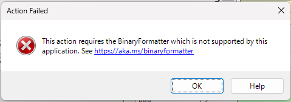

////
|metadata|
{
    "tags": [],
    "controlName": [""]
}
|metadata|
////

= Binary Formatter in NET 9

With the release of {ProductName} version 2024.2, we began support for the .NET 9 framework. As part of this release of .NET, Microsoft has retired the BinaryFormatter used by many Infragistics Windows Forms controls in different forms of Save and Load methods, effectively causing a large breaking change in our {ProductName} toolset. The removal of this class is documented link:https://devblogs.microsoft.com/dotnet/binaryformatter-removed-from-dotnet-9/[on Microsoft's site, here].

In order to continue using the various Save and Load methods on Infragistics controls that utilized the BinaryFormatter, the application must do the following:

1. Include the `System.Runtime.Serialization.Formatters` NuGet package as a reference in the project.
2. Set the `EnableUnsafeBinaryFormatterSerialization` flag in the .csproj or .vbproj file to `true`.

There is more information on the inclusion of the compatibility NuGet package and setting of the `EnableUnsafeBinaryFormatterSerialization` flag link:https://learn.microsoft.com/en-us/dotnet/standard/serialization/binaryformatter-migration-guide/compatibility-package[in this topic on Microsoft's site].

If you do not include both of the above-listed requirements, but then attempt to utilize one of the various Save or Load methods that utilized the BinaryFormatter, the .NET 9 framework will throw an exception, as the Serialize or Deserialize methods are called from the BinaryFormatter class. We now handle that exception, and you will see the following `MessageBox` indicating that the action failed:

If you do not wish to see this `MessageBox`, there are a couple of properties that you can set off of the `Infragistics.Win.Utilities` class to change this default behavior. These are listed below:

- `BinaryFormatterDisplaysUnsupportedMessage`: Setting this to `false` will suppress the `MessageBox` from being shown.
- `BinaryFormatterUnsupportedExceptionEnabled`: Setting this to `true` will force the BinaryFormatter functionality to attempt to continue, which will cause the BinaryFormatter's exception to be thrown.

== Affected Functionality

The following is a list of functionality that is affected by the removal of the BinaryFormatter:

* The `SaveAsBinary()` and `LoadFromBinary()` methods from the following classes:
** `CarouselPath`
** `NavigationBarPreviousLocationsCollection` (exposed by `UltraNavigationBar.PreviousLocations`)
** `UltraCarousel` 
** `UltraDataSource`
** `UltraDockManager`
** `UltraExplorerBar`
** `UltraListView`
** `UltraLiveTileView`
** `UltraPrintDocument`
** `UltraRadialMenu`
** `UltraTabbedMdiManager`
** `UltraTilePanel`
** `UltraToolbarsManager`
** `UltraTree`
** `VisitedLinksCollection` (exposed by `FormattedLinkEditor.VisitedLinks`)

* The `Save()` and `Load()` methods from the following classes:
** `UltraGridLayout` (exposed by `UltraGrid.Layout`)
** `UltraOfficeNavBar`
** `UltraPaletteInfo` (exposed by `UltraColorPalette.PaletteInfo`)

* Controls and components that automatically save or load via `SaveSettings`, `SaveComponentSettings`, and `LoadComponentSettings`:
** `UltraToolbarsManager`
** `UltraTree`

* The `SaveTabOrderAsBinary()` and `LoadTabOrderFromBinary()` methods of the following classes:
** `UltraTabControl`
** `UltraTabStripControl`

* The `FromBinary()`, `FromBytes()`, `Save()`, and `Load()` methods on the following classes relating to the `UltraWinSchedule` family of controls:
** `Appointment`
** `AppointmentRecurrence`
** `Note`
** `Owner (also has `SaveDateSettings()` and `LoadDateSettings()`)
** `Project`
** `Task`
** `UltraCalendarInfo`
** `UltraCalendarLook`

* The saving and loading of objects such as images and cursors in the `AppStylistRuntime`
* The internal `StyleAppearanceManager` in the `ConditionValueAppearanceForm` element used BinaryFormatter for storing and retrieving previously used styling.
