////
|metadata|
{
    "tags": [],
    "controlName": [""]
}
|metadata|
////

= What's New in 2017 Volume 1

This topic presents the new and enhanced controls and features for the Infragistics® Windows Forms 2017 Volume 1 release.

toc::[]

== ColPosChanged event improvement
We've improved the four ColPosChanged events to better accommodate column fixing. This improvement applies to the following events:

* link:{ApiPlatform}win.ultrawingrid{ApiVersion}~infragistics.win.ultrawingrid.ultragridbase~beforecolposchanged_ev.html[BeforeColPosChanged]
* link:{ApiPlatform}win.ultrawingrid{ApiVersion}~infragistics.win.ultrawingrid.ultragridbase~aftercolposchanged_ev.html[AfterColPosChanged]
* link:{ApiPlatform}win.ultrawingrid{ApiVersion}~infragistics.win.ultrawingrid.ultragrid~beforegroupposchanged_ev.html[BeforeGroupPosChanged]
* link:{ApiPlatform}win.ultrawingrid{ApiVersion}~infragistics.win.ultrawingrid.ultragrid~aftergroupposchanged_ev.html[AfterGroupPosChanged]

Previously, the PosChanged argument described the type of position change that occurred, but there was not an enum to denote that column positions were changed due to a fixing action. Instead, the PosChanged value would be Moved, causing ambiguity between fixing and moving actions.

ColumnPosChangedType is the new argument replacing PosChanged. It includes a FixedStateChanged flagged enum option to distinguish between fixing and moving actions.

Note that PosChanged has been obsoleted, not removed, so that existing apps depending on this argument can continue working as designed. As such, this is not a breaking change.

*Related Topics:*

* link:wingrid-specifying-fixed-columns.html[Specifying Fixed Columns -- ColPosChanged Events]

== Imperial Japanese Era Support in WinMaskedEdit/WinDateTimeEditor
The link:winmaskededit.html[WinMaskedEdit] and link:windatetimeeditor.html[WinDateTimeEditor] now have the ability to show the era of a DateTime by using the `g` or `gg` option in the `InputMask`. The era will be shown in accordance to the culture of the control, including modern Imperial Japanese eras.

By default, the culture will default to the machine's culture, so the `WinDateTimeEditor` and `WinMaskedEdit` will work out of the box when running on any machine by conforming to its culture setting. The control's culture can also be manually specified by the `CultureInfo` property for `WinMaskedEdit` or `FormatProvider` property for `WinDateTimeEditor`.

*Related Topics:*

* link:{ApiPlatform}win.ultrawinmaskededit{ApiVersion}~infragistics.win.ultrawinmaskededit.ultramaskededit~inputmask.html[InputMask Property (UltraMaskedEdit)]

== WinEditorMaskedControlBase Spin Wrapping
The link:windatetimeeditor.html[WinDateTimeEditor], link:wincurrencyeditor.html[WinCurrencyEditor], link:winmaskededit.html[WinMaskedEdit], and link:winnumericeditor.html[WinNumericEditor] each already had the ability to increment the current value when the user gives a certain input. Added in 17.1 is the ability for the developer to set the editor's behavior when a numeric section is incremented past its maximum range through the `SpinWrapBehavior` property. The options now available are:

* `Default` -- By default, the control will follow the `WrapAcrossSections` behavior.
* `NoWrapping` -- The value will stop incrementing/decrementing at the max/min.
* `WrapAcrossSections` -- The value will go to the min/max and increment/decrement the next high section.
+
For example, if a month set at 12 is incremented, the month will go to 1 and the year will be incremented by 1.
* `WrapCurrentSection` -- The value will go to the min/max and no other sections will be affected.
+
For example, if a month set at 12 is incremented, the month will go to 1 and the year will remain the same.

`SpinWrapBehavior` obsoletes its predecessor, the `SpinWrap` property. In order to reduce breaking existing applications, SpinWrap has been obsoleted rather than replaced. Therefore it will not be shown through IntelliSense, since SpinWrapBehavior is the preferred implementation, but it is still valid to set for the sake of legacy code.

The default behavior of all affected controls has been changed from `NoWrapping` to `WrapAcrossSections`, so any editors which did not have SpinWrap explicitly set will see that change in default behavior. This is a breaking change and is documented in link:win-breaking-changes-in-2017-volume-1.html[Breaking Changes in 2017 Volume 1]

*Related Topics:*

* link:winmaskededitorbase-spinning.html[WinEditorMaskedControlBase Spin]

== WinRadioButton

The
link:{ApiPlatform}win.ultrawineditors{ApiVersion}~infragistics.win.ultrawineditors.ultraradiobutton.html[WinRadioButton]
is a checkable button linked to other WinRadioButton's in a group. Its defining characteristic is that only 1 WinRadioButton within a group may be checked at one time, so when a WinRadioButton is selected, all others within the group become unchecked. This is useful in scenarios where a choice must be made between mutually exclusive options.

image:images/winradiobutton-control-containers.png[alt="Example of WinRadioButtons placed in WinGroupBoxes to cause them to be grouped by default."]

WinRadioButtons automatically group with other WinRadioButtons within the same control container by default, or they can be grouped manually by using a
link:{ApiPlatform}win.ultrawineditors{ApiVersion}~infragistics.win.ultrawineditors.ultraradiobuttongroupmanager.html[WinRadioButtonGroupManger]
component, allowing for a custom schema and uniform `Appearance` settings. Finally, the WinRadioButton can be used within the `WinGrid` to allow users to make an exclusive selection of a grid row.

*Related Topics:*

* link:winradiobutton-about.html[About WinRadioButton]
* link:winradiobutton-using-winradiobutton-within-wingrid.html[Using WinRadioButton within WinGrid]

== {GeoMapName}

The  link:{GeoMapLink}.{GeoMapName}.html[{GeoMapName}] control allows you to display data that contains geographic locations or geospatial data loaded from shape files on geographic imagery maps.

[cols="a,a"]
|====

|image:images/Whats_New_GeographicMap_2017_1_1.png[alt="{GeoMapName} with geographic imagery from Open Street Maps"]

Figure 1: link:{GeoMapLink}.{GeoMapName}.html[{GeoMapName}] with geographic imagery from Open Street Maps.

|image:images/Whats_New_GeographicMap_2017_1_2.png[alt="{GeoMapName} with geographic imagery from Bing™ Maps"]

Figure 2: link:{GeoMapLink}.{GeoMapName}.html[{GeoMapName}] with geographic imagery from Bing™ Maps.

|====

|image:images/Whats_New_GeographicMap_2017_1_3.png[alt="{GeoMapName} with multiple geographic series."]

Figure 3: link:{GeoMapLink}.{GeoMapName}.html[{GeoMapName}] with multiple geographic series.

*Related Topics:*

* link:{GeoMapLink}.{GeoMapName}.html[{GeoMapName}]

== UltraPeekPopup
Similar to the link:winofficenavbar-peek-window.html[OfficeNavBar Peek Window], WinPeekPopup™ can display any Windows Forms Control in a stylized popup window. The new UltraPeekPopup is a standalone component that can be used independently from other controls.

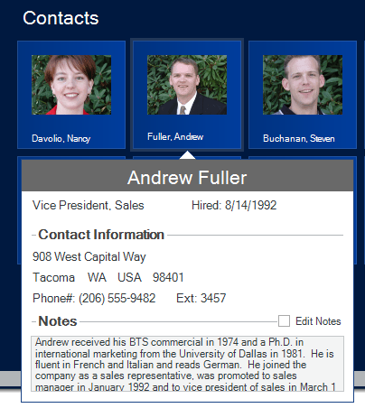

*Related Topics:*

* link:winpeekpopup.html[WinPeekPopup]
* link:winpeekpopup-about-winpeekpopup.html[About WinPeekPopup]
* link:winpeekpopup-using-a-winpeekpopup.html[Using A WinPeekPopup]

== Notification Badges

Notification Badges allow you to notify your users about important events that require their attention. This feature, previously exclusive to UltraToolbarsManager, now is supported in the following controls:

* link:wintree.html[WinTree]
* link:wintab.html[WinTab and WinTabStrip]
* link:winstatusbar.html[WinStatusBar]
* link:winlistview.html[WinListView]
* link:winexplorerbar.html[WinExplorerBar]

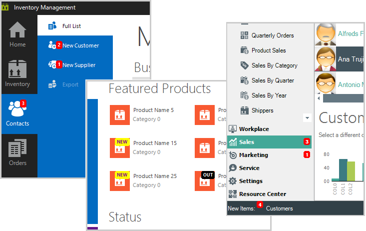

*Related Topics:*

* link:wintree-using-the-notification-badge.html[WinTree Using the Notification Badge]
* link:wintoolbarsmanager-using-the-notification-badge.html[WinToolbarsManager Using the Notification Badge]
* link:winlistview-using-the-notification-badge.html[WinListView Using the Notification Badge]
* link:winstatusbar-using-the-notification-badge.html[WinStatusBar Using the Notification Badge]
* link:winexplorerbar-using-the-notification-badge.html[WinExplorerBar Using the Notification Badge]
* link:wintab-using-the-notification-badge.html[WinTab Using the Notification Badge]

== Editable Headers

Enabling the Editable Headers feature allows users to modify column, group, and band headers on the UltraGrid. When enabled, users can edit a header by double clicking it or by taking any other action specified by the developer.

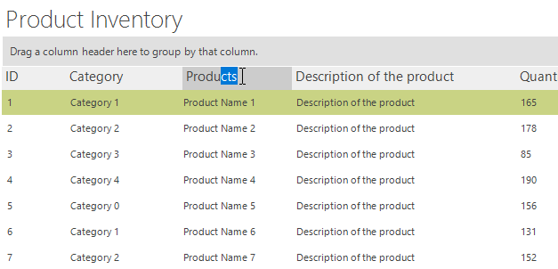

*Related Topics:*

* link:wingrid-editable-headers-in-wingrid.html[Editable Headers in WinGrid]

== UltraDataChart

=== *_Design Changes_* 

In the Infragistics 2017 volume 1 release, we redesigned the defaults of the UltraDataChart, UltraPieChart, UltraDoughnutChart, and UltraRadialGauge controls.

The following screenshots are some examples:

==== *Column Chart*

*New* 

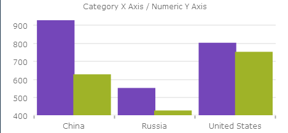

*Previous*

image:images/chart_design_column_previous.png[columnchartprevious]

==== *Stacked Area*
*New*

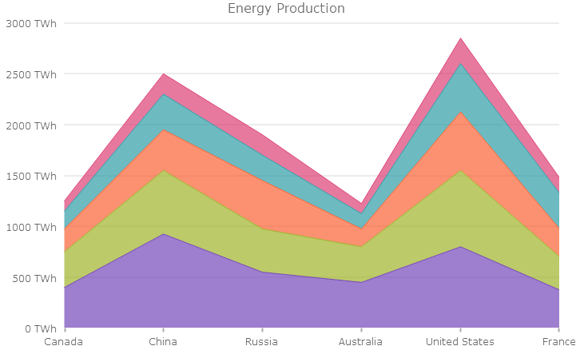

*Previous*

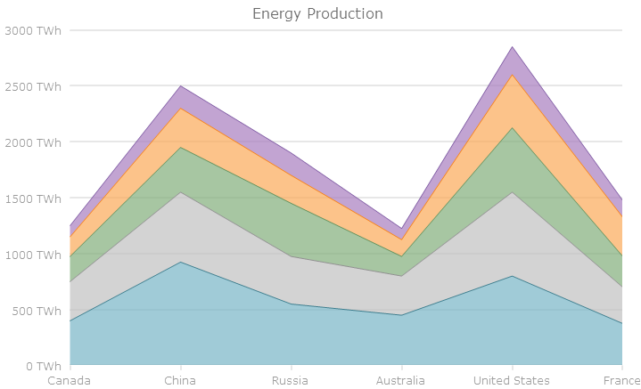

==== *Candlestick Chart*
*New*

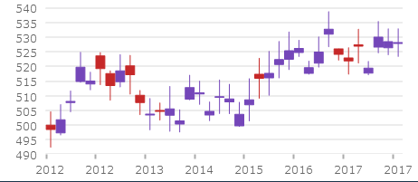

*Previous*

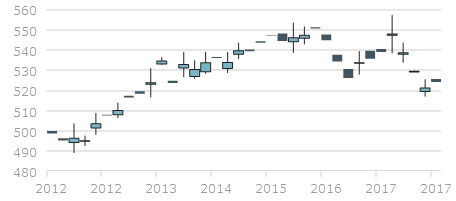

==== *Pie Chart*
*New*

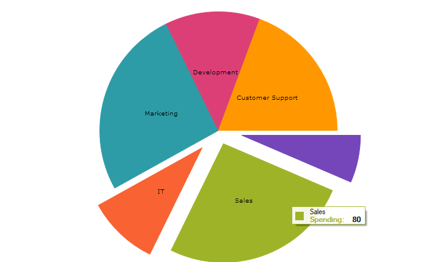

*Previous*

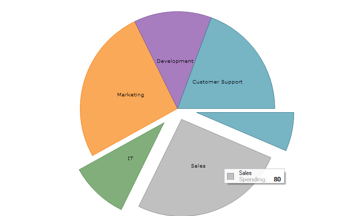

==== *Radial Gauge*
*New*

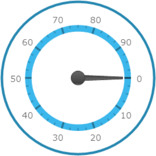

*Previous*

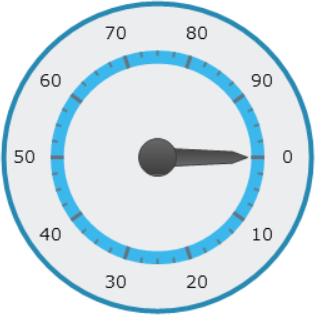