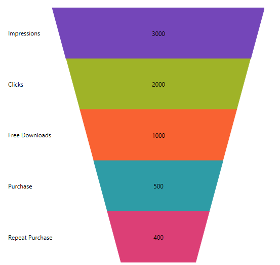
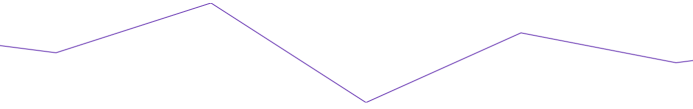
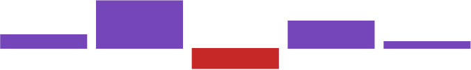
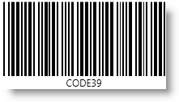
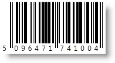
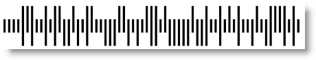
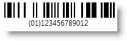
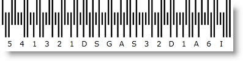
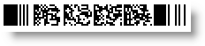
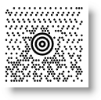

////
|metadata|
{
    "tags": [],
    "controlName": [""]
}
|metadata|
////

= What's New in 2017 Volume 2

This topic presents the new and enhanced controls and features for the Infragistics® Windows Forms 2017 Volume 2 release.

toc::[]

= New Controls
== UltraCategoryChart
The UltraCategoryChart is a lightweight, highly performant chart. This chart can be easily configured to display category data using an extremely simple and intuitive API. All you need to do is bind your data (a collection or a collection of collections) and the chart takes care of everything else.
The following screenshot demonstrates a column series displayed within the Category Chart.
 
image::images/Whats_New_in_2017_Volume_2_1.png[]

By using a smart Data Adapter, the data is analyzed and the appropriate visualization is rendered. For example, if the ChartType is set to "Auto", the control can determine that if it is provided a small data set then a column chart should be plotted, while a larger data set will draw a line chart.
However, you can also explicitly specify the chart type by setting the ChartType to:

* Line
* Area
* Column
* Point
* Spline
* SplineArea
* StepArea
* StepLine
* Waterfall

Another example of the intuitive behavior of the Category Chart control is that you do not need to explicitly set the labels. The Category Chart will use the first appropriate string property that it finds within the data you provided and will use that for the labels.
Built to be easily configurable, it uses the Data Chart control as its engine, which means that it benefits from the high performing and powerful Data Chart. You can also avail of the features of the data chart control if you want to avail of them.

*Related Topics:*

* link:categorychart-overview.html[UltraCategoryChart]

== UltraFunnelChart
A funnel chart is a type of chart that displays quantities as percentages of a whole, much like a pie chart. Funnel charts are commonly used to display quantitative data in relation to stages of a process. For example, a funnel chart might display expenses of a product from the manufacturing stage to the actual sale of that product.  

*Related Topics:*

* link:funnelchart.html[UltraFunnelChart]

== UltraBulletGraph
The UltraBulletGraph control is an Ultimate UI for Windows Forms control that allows for visualizing data in the form of a bullet graph. Linear by design, it provides a simple and concise view of a primary measure compared against a scale and optionally, some other measure.

*Related Topics:*

* link:bulletgraph.html[UltraBulletGraph]

image::images/Whats_New_in_2017_Volume_2_3.png[]

== UltraLinearGauge
The UltraLinearGauge control allows visualizing data in the form of a linear gauge. It provides a simple and concise view of a primary value compared against a scale and one or more comparative ranges.

image::images/Whats_New_in_2017_Volume_2_4.png[]

*Related Topics:*

* link:lineargauge.html[UltraLinearGauge]
 
== UltraSparkline
The UltraSparkLine is a lightweight charting control that can render the following chart types:

==== Line

==== Area  

==== Column  

==== Win/Loss  

It is intended for rendering in a small scale layout such as a grid Cell. It can also be rendered stand alone. The following previews illustrate the four Sparkline types.

*Related Topics:*

* link:sparkline.html[UltraSparkline]

== Barcodes
=== Code 39
The UltraCode39Barcode™ generates the Code 39 symbology (also known as USS Code 39, Code 3 of 9), which is the first alpha-numeric symbology developed to be used in a non-retail environment. It can be decoded with virtually any barcode reader.
  

*Related Topics:*

* link:xambarcode-xamcode39barcode.html[Code 39]

=== Ean\UPC
The UltraEanUpcBarcode™ supports the following numeric symbologies set by the CodeType property value:
* EAN-13 – set with CodeType=”Ean13”. This symbology encodes 12 digits of numeric characters and adds one Check Digit which is not a part of the Data value itself.
The EAN13 Data consists of the following information: one digit for the Number System, 6 digits for the Manufacturer Code, 5 digits for the Product Code and one Check Digit. The Number System is positioned at the left of the barcode.
The Manufacturer Code and the Product Code are positioned under the barcode, separated by the guard bar. 

*Related Topics:*

* link:xambarcode-xameanupcbarcode.html[Ean\UPC]

=== Interleaved 2 of 5
The Interleaved 2 Of 5 barcode is a high-density numeric barcode symbology. It encodes only an even number of digits, as 0 is added at the beginning if an odd number is entered. A checksum can be generated by setting the UltraInterleaved2Of5Barcode™ control property ShouldGenerateChecksum to True.
Note that the checksum is not part of the Data value property. 
 
image::images/Whats_New_in_2017_Volume_2_11.png[]

*Related Topics:*

* link:xambarcode-xaminterleaved2of5barcode.html[Interleaved 2 of 5]
 
=== Intelligent Mail
The Intelligent Mail barcode is a 65-bar code for use in the USPS mail stream. It combines routing ZIP Code information and tracking information into a single barcode using four distinct, vertical bar types (each bar is in one of the following states - full bar, ascender, tracker and descender). It effectively encodes data from POSTNET and PLANET barcodes into a single barcode while providing a greater range of tracking data. 

*Related Topics:*

* link:xambarcode-xamintelligentmailbarcode.html[Intelligent Mail]

=== GS1 DataBar
GS1 DataBar is a code symbology which encodes data starting with an AI and a trailing GTIN. AI is an Application Identifier – ‘(01)’, which is not expected to be in the Data input except in the GS1 DataBar Expanded versions. GTIN is the acronym for Global Trade Item Number that identifies trade items developed by the GS1 organization.
The first digit of the GTIN is a package indicator. The digits 0 and 9 have special meanings – 0 often means that there is one item in the box, and 9 indicates a variable measure item. The package indicator is followed by GS1 company prefix (assigned by GS1) and item number (assigned by the company).
GS1 DataBar is a family of barcode symbologies. The first (including Omnidirectional, Truncated, Stacked and Stacked Omnidirectional) and the second (including Limited) groups of the GS1 DataBar symbols encode the Element String AI (01) which is why it is not part of the Data input itself. This Element String is based on the GTIN-12, GTIN-13, or GTIN-14 Data Structures and the Data input should be 11, 12 or 13 digits long as the last check digit is internally calculated. When using the GTIN-14 Data Structure with Limited symbology, only the indicator value (the first digit) 1 is allowed. The GS1 DataBar Limited Bar Code Symbol is designed for small items that will not need to be read by omnidirectional Point-of-Sale (POS) scanners. The third group of GS1 DataBar symbols, so called Expanded versions, includes Expanded and ExpandedStacked symbologies. They are variable length linear symbologies capable of encoding up to 74 numeric or 41 alphabetic characters of AI Element String data. The two versions are designed to encode primary and supplementary data on items for Point-of-Sale (POS) and other applications. 

*Related Topics:*

* link:xambarcode-xamgs1databarbarcode.html[GS1 DataBar]

=== Royal Mail
The Royal Mail 4-state Customer Code (RM4SCC) is a height-modulated barcode for use in automated mail sort process. A checksum is printed as the last character to provide error protection which is not part of the Data itself. 

*Related Topics:*

* link:xambarcode-xamroyalmailbarcode.html[Royal Mail]

=== PDF 417
PDF417 is a stacked linear barcode symbol format used in a vafsriety of applications, primarily transport, identification cards, and inventory management. PDF stands for Portable Data File. The 417 signifies that each pattern in the code consists of 4 bars and spaces, and that each pattern is 17 units long.
PDF417 is one of the formats (along with Data Matrix) that can be used to print postage accepted by the United States Postal Service. PDF417 is also selected by the airline industry's Bar Coded Boarding Pass standard (BCBP) as the 2D bar code symbolism for paper boarding passes. PDF417 is the standard selected by the Department of Homeland Security as the machine readable zone technology for RealID compliant driver licenses and state issued identification cards. It is also used by FedEx on package labels. 
 

*Related Topics:*

* link:xambarcode-xampdf417barcode.html[PDF 417]

=== Maxi Code
MaxiCode is a 2D error-correcting matrix symbol used by United Parcel Service (UPS) for package tracking. The two-dimensional symbology is made up by offset rows of hexagonal elements around a unique circular finder pattern, called also bullseye, which is useful in quick symbol location regardless of orientation. 

*Related Topics:*

* link:xambarcode-xammaxicodebarcode.html[Maxi Code]
 
= Improvements to Features / Controls 
=== UltraGrid - Editors in ColumnHeaders
By setting the Editor property on a Header, you can now embed any editor that inherit from EmbeddableEditorBase into a column, group, or band headers on the UltraGrid. We offer a number of highly customizable editors for this purpose, as well as the ability to add editors of your own creation for this purpose, users can edit a header by double clicking it or by taking any other action specified by the developer.

*Related Topics:*

* link:wingrid-editable-headers-in-wingrid.html[Editable Headers in the WinGrid]