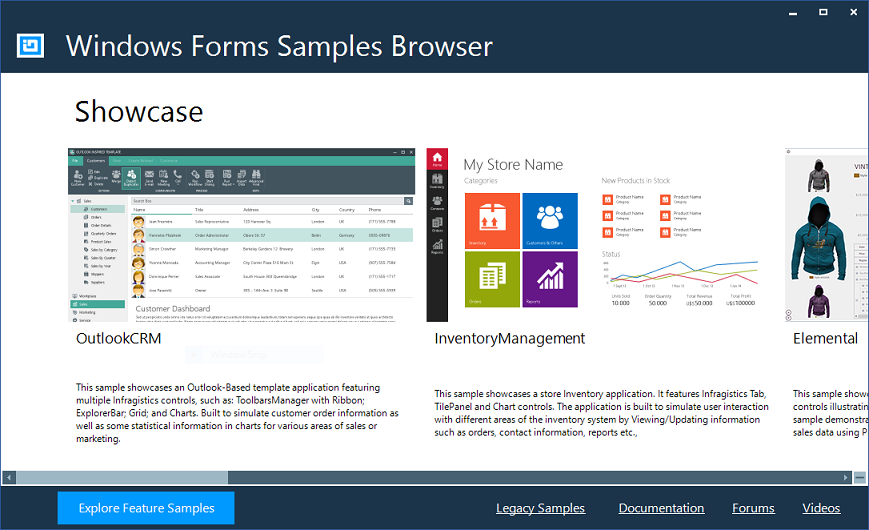

= {ProductName} Samples

[[Infragistics-WPF-Features-Browser]]
== Samples Browser

The Samples Browser is geared towards the idea of learning by example, by demonstrating the usage of the extensive feature set of the {ProductName} controls. Choose between our Showcase Samples, Feature Samples, and our Legacy Samples along with their source code with full C# and VB.NET projects.

link:https://www.infragistics.com/products/windows-forms/download/samples_browser[Download Samples Browser]

