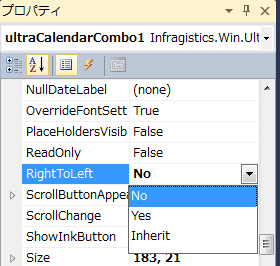

////

|metadata|
{
    "name": "right-to-left-support",
    "controlName": [],
    "tags": [],
    "guid": "d99d7e5f-87a1-4969-a38b-fcf382a5e1f1",  
    "buildFlags": [],
    "createdOn": "2014-01-29T03:57:32.451375Z"
}
|metadata|
////

= 右から左へのサポート

[[_Ref000000001]]

== トピックの概要

=== 目的

このトピックは、右から左の環境をサポートする {ProductName} コントロールをリストします。

=== このトピックの内容

このトピックは、以下のセクションで構成されます。

* <<_Ref378713572,右から左>>

** <<_Ref377393133,はじめに>>
** <<_Ref377393142,右から左へのモードを設定する>>
** <<_Ref377393151,パフォーマンス>>

* <<_Ref377393160,サポートされるコントロール>>

** <<_Ref377393167, _WinButton_  >>
** <<_Ref377393174, _WinCalculatorDropDown_  >>
** <<_Ref377393274, _WinCalendarCombo_  >>
** <<_Ref377393281, _WinCheckEditor_  >>
** <<_Ref377393295, _WinColorPicker_  >>
** <<_Ref377393303, _WinCombo_  >>
** <<_Ref377393312, _WinComboEditor_  >>
** <<_Ref377393320, _WinCurrencyEditor_  >>
** <<_Ref377480932, _WinDateTimeEditor_  >>
** <<_Ref377393455, _WinDockManager_  >>
** <<_Ref377393454, _WinDropDownButton_  >>
** <<_Ref377393463, _WinFontNameEditor_  >>
** <<_Ref377393477, _WinFormattedLinkLabel_  >>
** <<_Ref377393485, _WinFormattedTextEditor_  >>
** <<_Ref377393490, _WinGrid_  >>
** <<_Ref377393496, _WinLabel_  >>
** <<_Ref377480947, _WinMaskedEdit_  >>
** <<_Ref377480955, _WinNumericEditor_  >>
** <<_Ref377393504, _WinOptionSet_  >>
** <<_Ref377393513, _WinProgressBar_  >>
** <<_Ref377393521, _WinScrollBar_  >>
** <<WinTabControl, _WinTabControl_  >>
** <<WinTabStripControl, _WinTabStripControl_  >>
** <<_Ref377393528, _WinTextEditor_  >>
** <<_Ref377393539, _WinTimeSpanEditor_  >>
** <<_Ref377393546, _WinTimeZoneEditor_  >>
** <<_Ref377393554, _WinTrackBar_  >>
** <<_Ref377393565, _WinTree_  >>

[[_Ref378713572]]
== 右から左

[[_Ref377393133]]

=== はじめに

`Right-to-Left` モードは、コントロールの表示されるテキストおよび UI 要素を水平方向に反転します。コントロールの表示されるテキストおよび UI 要素がミラーされます。この要素は通常 `Left-to-Right` 方向で表示さます。複数のコントロールは UI 要素のみで `Right-to-Left` をサポートします。その他のコントロールは UI 要素およびテキストでサポートします。

以下の  _WinCalendarCombo_   コントロールでは、`RightToLeft=Yes` を設定する場合、テキスト (文字位置ではない) およびドロップダウン ボタンの位置が反転されます。

[options="header", cols="a,a"]
|====
|左から右 (デフォルト ビュー)|右から左

|image::images/Right_to_Left_Support_1.png[]
|image::images/Right_to_Left_Support_2.png[]

|====

`RightToLeft` プロパティに 3 つのオプションがあります。

[options="header", cols="a,a"]
|====
|オプション|説明

|No
|`Right-to-Left` を無効にします (デフォルト値: `Left-to-Right`)。

|Yes
|`Right-to-Left` を有効にします。

|Inherit
|`RightToLeft` モードを親コンテナー (フォームまたはその他のコントロール) から継承します。 

フォームで `RightToLeft=Yes` を設定し、`RightToLeft=Inherit` に設定されるコントロールはフォームの設定によってオーバーライドされます。

|====

[[_Ref376430820]]

=== 右から左へのモードを設定する

新しい `Right-to-Left` モードを Visual Studio デザイナーのコントロール プロパティによって設定するか、コードで設定できます。

プロパティ グリッドで `Right-to-Left` を構成します。

コードで `Right-to-Left` を構成します。

*C# の場合:*

[source,csharp]
----
WinCalendarCombo1.RightToLeft = RightToLeft.Yes;
----

*Visual Basic の場合:*

[source,vb]
----
WinCalendarCombo1.RightToLeft = RightToLeft.Yes
----

[[_Ref377393151]]

=== パフォーマンス

`Right-to-Left` モードはパフォーマンスに影響する可能性があります。この機能の実装はフレームワーク レベルで描画メソッドを変更するため、パフォーマンスが低下する場合があります。

<<_Ref000000001,上に戻る>>

[[_Ref377393160]]
== サポートされるコントロール

[[_Ref377393167]]

=== WinButton

テキスト キャプションおよび表示されたアイコンなどの要素で `Right-to-Left` をサポートします。デフォルトで、テキストはボタンに中央揃えされます。以下の実例では、`Right-to-Left` モードを表示するために左に揃えました。

[options="header", cols="a,a"]
|====
|左から右 (デフォルト ビュー)|右から左

|image::images/Right_to_Left_Support_4.png[]
|image::images/Right_to_Left_Support_5.png[]

|====

[[_Ref377393174]]

=== WinCalculatorDropDown

編集部分およびドロップダウンで `Right-to-Left` をサポートします。

[options="header", cols="a,a"]
|====
|左から右 (デフォルト ビュー)|右から左

|image::images/Right_to_Left_Support_6.png[]
|image::images/Right_to_Left_Support_7.png[]

|====

[[_Ref377393274]]

=== WinCalendarCombo

編集部分 (日付) およびドロップダウン ボタンで `Right-to-Left` をサポートします。ドロップダウン コンテンツでサポートされません。

[options="header", cols="a,a"]
|====
|左から右 (デフォルト ビュー)|右から左

|image::images/Right_to_Left_Support_8.png[]
|image::images/Right_to_Left_Support_9.png[]

|====

[[_Ref377393281]]

=== WinCheckEditor

テキストおよびチェックボックス要素で `Right-to-Left` をサポートします。

[options="header", cols="a,a"]
|====
|左から右 (デフォルト ビュー)|右から左

|image::images/Right_to_Left_Support_10.png[]
|image::images/Right_to_Left_Support_11.png[]

|====

[[_Ref377393295]]

=== WinColorPicker

編集部分、ドロップダウン ボタン、およびドロップダウンで `Right-to-Left` をサポートします。

[options="header", cols="a,a"]
|====
|左から右 (デフォルト ビュー)|右から左

|image::images/Right_to_Left_Support_12.png[]
|image::images/Right_to_Left_Support_13.png[]

|====

[[_Ref377393303]]

=== WinCombo

編集部分、ドロップダウン ボタン、およびドロップダウン コンテンツで `Right-to-Left` をサポートします。

[options="header", cols="a,a"]
|====
|左から右 (デフォルト ビュー)|右から左

|image::images/Right_to_Left_Support_14.png[]
|image::images/Right_to_Left_Support_15.png[]

|====

[[_Ref377393312]]

=== WinComboEditor

編集部分、ドロップダウン ボタン、およびドロップダウン コンテンツで `Right-to-Left` をサポートします。

[options="header", cols="a,a"]
|====
|左から右 (デフォルト ビュー)|右から左

|image::images/Right_to_Left_Support_16.png[]
|image::images/Right_to_Left_Support_17.png[]

|====

[[_Ref377393320]]

=== WinCurrencyEditor

スピン ボタンなどの要素で `Right-to-Left` をサポートします。編集部分ではサポートされません。

[options="header", cols="a,a"]
|====
|左から右 (デフォルト ビュー)|右から左

|image::images/Right_to_Left_Support_18.png[]
|image::images/Right_to_Left_Support_19.png[]

|====

[[_Ref377480932]]

=== WinDateTimeEditor

ドロップダウン ボタンで `Right-to-Left` をサポートします。表示される日付の編集部分ではサポートされません。

[options="header", cols="a,a"]
|====
|左から右 (デフォルト ビュー)|右から左

|image::images/Right_to_Left_Support_20.png[]
|image::images/Right_to_Left_Support_21.png[]

|====

[[_Ref377393455]]

=== WinDockManager

ドックパネルで `右から左` 方向への表示をサポートします。
オプトインするには、フォームの RightToLeft プロパティおよび RightToLeftLayout プロパティを適切に設定する必要があります。

C# の場合:
[source,csharp]
----
this.RightToLeft = RightToLeft.Yes;
this.RightToLeftLayout = true;
----

VB の場合:
[source,vb]
----
Me.RightToLeft = RightToLeft.Yes
Me.RightToLeftLayout = True
----

[options="header", cols="a,a"]
|====
|左から右|右から左

|image::images/Right_to_Left_Support_DockManager_Left.png[]
|image::images/Right_to_Left_Support_DockManager_Right.png[]

|====

[[_Ref377393454]]

=== WinDropDownButton

テキスト キャプションおよびドロップダウン ボタンで `Right-to-Left` をサポートします。デフォルトで、テキストはボタンに中央揃えされます。以下の実例では、`Right-to-Left` モードを表示するために左に揃えました。

[options="header", cols="a,a"]
|====
|左から右|右から左

|image::images/Right_to_Left_Support_22.png[]
|image::images/Right_to_Left_Support_23.png[]

|====

[[_Ref377393463]]

=== WinFontNameEditor

編集部分、ドロップダウン ボタン、およびドロップダウンで `Right-to-Left` をサポートします。

[options="header", cols="a,a"]
|====
|左から右 (デフォルト ビュー)|右から左

|image::images/Right_to_Left_Support_24.png[]
|image::images/Right_to_Left_Support_25.png[]

|====

[[_Ref377393477]]

=== WinFormattedLinkLabel

ボタン要素で `Right-to-Left` をサポートします。テキストではサポートされません。

[options="header", cols="a,a"]
|====
|左から右 (デフォルト ビュー)|右から左

|image::images/Right_to_Left_Support_26.png[]
|image::images/Right_to_Left_Support_27.png[]

|====

[[_Ref377393485]]

=== WinFormattedTextEditor

ボタン要素で `Right-to-Left` をサポートします。テキストではサポートされません。

[options="header", cols="a,a"]
|====
|左から右 (デフォルト ビュー)|右から左

|image::images/Right_to_Left_Support_28.png[]
|image::images/Right_to_Left_Support_29.png[]

|====

[[_Ref377393490]]

=== WinGrid

列およびセル コンテンツの`右から左`配置をサポートします。

[options="header", cols="a,a"]
|====
|左から右 (デフォルト ビュー)|右から左

|image::images/Right_to_Left_Support_Grid_R.png[]
|image::images/Right_to_Left_Support_Grid_L.png[]

|====

[[_Ref377393496]]

=== WinLabel

テキスト ボックスおよびボタン、アイコンなどのテキスト ボックスに追加された要素で `Right-to-Left` をサポートします。

[options="header", cols="a,a"]
|====
|左から右 (デフォルト ビュー)|右から左

|image::images/Right_to_Left_Support_30.png[]
|image::images/Right_to_Left_Support_31.png[]

|====

[[_Ref377480947]]

=== WinMaskedEdit

スピン ボタンなどの要素で `Right-to-Left` をサポートします。値を表示する編集部分ではサポートされません。

[options="header", cols="a,a"]
|====
|左から右 (デフォルト ビュー)|右から左

|image::images/Right_to_Left_Support_32.png[]
|image::images/Right_to_Left_Support_33.png[]

|====

[[_Ref377480955]]

=== WinNumericEditor

スピン ボタンなどの要素で `Right-to-Left` をサポートします。数値を表示する編集部分でサポートされません。

[options="header", cols="a,a"]
|====
|左から右 (デフォルト ビュー)|右から左

|image::images/Right_to_Left_Support_34.png[]
|image::images/Right_to_Left_Support_35.png[]

|====

[[_Ref377393504]]

=== WinOptionSet

テキストおよびラジオ ボタン要素で `Right-to-Left` をサポートします。

[options="header", cols="a,a"]
|====
|左から右 (デフォルト ビュー)|右から左

|image::images/Right_to_Left_Support_36.png[]
|image::images/Right_to_Left_Support_37.png[]

|====

[[_Ref377393513]]

=== WinProgressBar

表示されるテキストおよび進行状況インジケーターの値部分 (緑色) で `Right-to-Left` をサポートします。

[options="header", cols="a,a"]
|====
|左から右 (デフォルト ビュー)|右から左

|image::images/Right_to_Left_Support_38.png[]
|image::images/Right_to_Left_Support_39.png[]

|====

[[_Ref377393521]]

=== WinScrollBar

つまみボタンで `Right-to-Left` をサポートします。

[options="header", cols="a,a"]
|====
|左から右 (デフォルト ビュー)|右から左

|image::images/Right_to_Left_Support_40.png[]
|image::images/Right_to_Left_Support_41.png[]

|====

[[WinTabControl]]

=== WinTabControl

タブ コントロールで `Right-to-Left` をサポートします。

[options="header", cols="a,a"]
|====
|左から右 (デフォルト ビュー)|右から左

|image::images/tabRTL_1.png[]
|image::images/tabRTL_2.png[]

|====

[[WinTabStripControl]]

=== WinTabStripControl

タブ ストリップ コントロールで `Right-to-Left` をサポートします。

[options="header", cols="a,a"]
|====
|左から右 (デフォルト ビュー)|右から左

|image::images/tabRTL_1.png[]
|image::images/tabRTL_2.png[]

|====

[[_Ref377393528]]

=== WinTextEditor

編集部分およびアイコンなどの追加された要素で `Right-to-Left` をサポートします。

[options="header", cols="a,a"]
|====
|左から右 (デフォルト ビュー)|右から左

|image::images/Right_to_Left_Support_42.png[]
|image::images/Right_to_Left_Support_43.png[]

|====

[[_Ref377393539]]

=== WinTimeSpanEditor

テキストおよびスピン ボタン要素で `Right-to-Left` をサポートします。

[options="header", cols="a,a"]
|====
|左から右 (デフォルト ビュー)|右から左

|image::images/Right_to_Left_Support_44.png[]
|image::images/Right_to_Left_Support_45.png[]

|====

[[_Ref377393546]]

=== WinTimeZoneEditor

編集部分、ドロップダウン ボタン、およびドロップダウンで `Right-to-Left` をサポートします。

[options="header", cols="a,a"]
|====
|左から右 (デフォルト ビュー)|右から左

|image::images/Right_to_Left_Support_46.png[]
|image::images/Right_to_Left_Support_47.png[]

|====

[[_Ref377393554]]

=== WinTrackBar

コントロールが以下に配置された場合、つまみボタンおよび目盛りで `Right-to-Left` をサポートします。

* * 水平方向に配置 - つまみボタンがミラーされます。

* * 垂直方向に配置 - つまみボタンと目盛りが向き合って配置されます。

[options="header", cols="a,a"]
|====
|左から右 (デフォルト ビュー)|右から左

|image::images/Right_to_Left_Support_48.png[]
|image::images/Right_to_Left_Support_49.png[]

|image::images/Right_to_Left_Support_50.png[]
|image::images/Right_to_Left_Support_51.png[]

|====

[[_Ref377393565]]

=== WinTree

ツリー ノードで `Right-to-Left` をサポートします。

[options="header", cols="a,a"]
|====
|左から右 (デフォルト ビュー)|右から左

|image::images/Right_to_Left_Support_52.png[]
|image::images/Right_to_Left_Support_53.png[]

|====

<<_Ref000000001,上に戻る>>