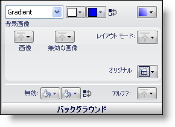
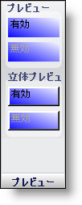
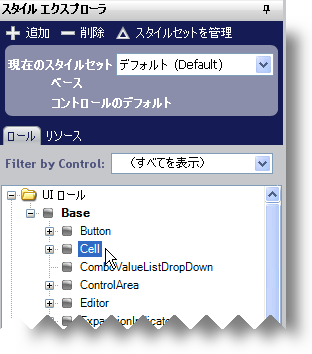
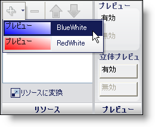
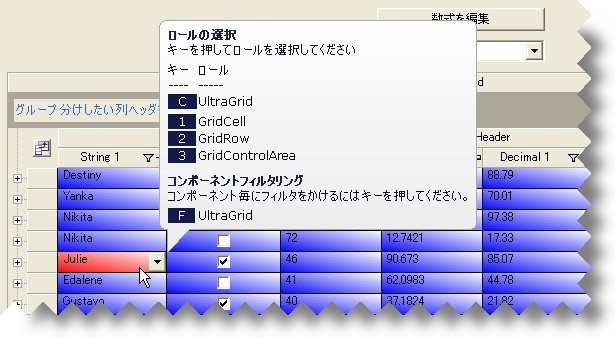

////

|metadata|
{
    "name": "styling-guide-applying-a-resource-to-a-state",
    "controlName": [],
    "tags": ["Styling","Theming"],
    "guid": "{3F0A19FD-AE29-4063-8455-D99A5F00BEC6}",  
    "buildFlags": [],
    "createdOn": "0001-01-01T00:00:00Z"
}
|metadata|
////

= リソースを状態に適用

適用したいスタイルでリソースを作成することによって、異なる状態を素早くスタイルすることができます。

=== リソースを作成するためには、次の手順に従ってください。

[start=1]
. スタイル エクスプローラで [リソース] タブをクリックします。
[start=2]
. [新規追加] をクリックします。新しいリソースが追加されます。
[start=3]
. リソース名を BlueWhite に変更します。
[start=4]
. 背景スタイルを [グラデーション] に変更します。最初の色を白に、2 番目の色を青に変更します。[グラデーション] のスタイルを BackwardDiagonal に変更します。

[プレビュー] パネルは、リソース作成時に重要なツールです。これはスタイルがどのように見えるのかをプレビューする唯一の方法です。リソースはキャンバス領域に表示できる UI ロールに関連付けられないからです。UI ロール エディタで [プレビュー] が有効な場合、以下のように表示されます。

[start=5]
. 手順 1 から 4 にしたがって、リソースをもうひとつ作成します。ただし今回はリソース名を RedWhite に変更し、青の代わりにグラデーションの 2 番目の色を赤に変更します。これで BlueWhite と RedWhite という 2 つのリソースがあるはずです。

=== リソースを状態に適用するには、次の手順に従ってください。

[start=1]
. スタイル エクスプローラで [ロール] タブをクリックします。
[start=2]
. UI Roles ノードの下で、Base を展開し、次にセル UI ロールを選択します。

[NOTE]
====
*注:* セル UI ロールに行った変更を見るには、Ｇrid キャンバスまたはセル UI ロールを含む別のキャンバスが表示されることを確認します。
====

[start=3]
. セル UI ロールの [ノーマル] の状態に BlueWhite リソースを追加します。

[start=4]
. セル UI ロールの [HotTracked] の状態に RedWhite リソースを追加します。

Grid キャンバスを表示している場合には、適用された青/白のグラデーションがあらゆるセルにあることが分かります。任意のセルの上にマウスを移動して、マウス ポインタが上に置かれているセルに赤/白のグラデーションが付いて表示されます。

