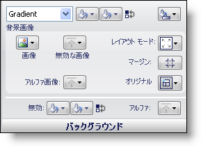

////

|metadata|
{
    "name": "styling-guide-background-pane",
    "controlName": [],
    "tags": ["Styling","Theming"],
    "guid": "{3F236051-1B21-4C66-8C8F-8599DFB465F9}",  
    "buildFlags": [],
    "createdOn": "0001-01-01T00:00:00Z"
}
|metadata|
////

= 背景ペイン

Background プロパティは、背景の塗りつぶし、背景画像、無効な状態の色、アルファ レベルなど、UI ロールの状態の背景がどのように表示されるのかを決定します。

*背景の塗りつぶし* – べた一色、グラデーション、ハッチ パターンで状態の背景を塗りつぶすことができます。[グラデーション] または [ハッチ] が選択されると、グラデーションまたはハッチのタイプを選択することができるボタンだけでなく、2 番目の色のためにもうひとつの [塗りつぶし] ボックスが表示します。1 番目と 2 番目の背景色を [色の交換] ボタンで素早く交換することができます。

*背景画像* – [画像] ボタンをクリックすることによって、状態の背景に使用する画像を設定できます。ドロップダウン メニューから [ファイル] を選択すると、[ファイルを開く] ダイアログ ボックスが表示されます。状態が無効のときのために異なる画像を設定することも可能です。レイアウト モードによって、画像をセンタリング、引き伸ばす、またはタイル表示することができます。[引き伸ばし] を選択すると、[マージン] ボタンが [レイアウト モード] ボタンの真下に表示されます。[マージン] ボタンをクリックすることによって、引き伸ばしたくない画像の部分を指定することができます。これは、ボタンに適用される画像に役に立ちます。[画像アルファ] ボタンによって、[アルファ レベルの使用]、[不透明]、[透明] を選択できます。[アルファ レベルの使用] を選択すると、UI ロール エディタの [その他] ペインからアルファ レベルを使用します。

*無効* – [無効] ボタンによって、状態が無効になった時の背景の色を選択できます。

*アルファ* – [アルファ] ボタンによって、背景に [その他] ペインの [アルファ レベル] を使用するか、不透明または透明に表示するかを選択できます。

