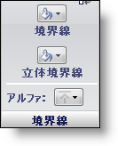

////

|metadata|
{
    "name": "styling-guide-border-pane",
    "controlName": [],
    "tags": ["Styling","Theming"],
    "guid": "{8D787FE6-4A5B-4FB8-AC85-E10556C52069}",  
    "buildFlags": [],
    "createdOn": "0001-01-01T00:00:00Z"
}
|metadata|
////

= 境界線ペイン

Border プロパティは、境界線、境界線 3D、アルファなど、UI ロールの状態の境界線がどのように表示されるのかを決定します。

*境界線* – [境界線] ボタンによって、その状態の境界線の色を選択できます。カラー ピッカーの一番上にある [透明] ボタンをクリックすることによって、境界線を透明に表示することも可能です。

*立体境界線* – [立体境界線] ボタンによって、その状態の立体境界線の色を選択できます。カラー ピッカーの一番上にある [透明] ボタンをクリックすることによって、立体境界線を透明に表示することも可能です。

*アルファ* – [アルファ] ボタンによって、[その他] ペインの [アルファ レベル] を使用するか、境界線を不透明または透明に表示するかを選択できます。

