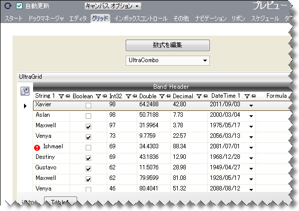
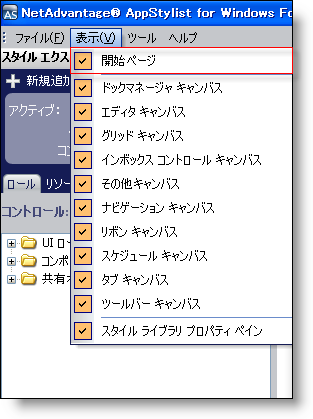
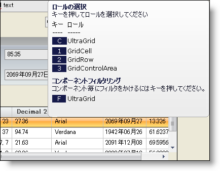

////

|metadata|
{
    "name": "styling-guide-canvas",
    "controlName": [],
    "tags": ["Styling","Theming"],
    "guid": "{594B6953-09EB-419A-8166-17856C4D6420}",  
    "buildFlags": [],
    "createdOn": "0001-01-01T00:00:00Z"
}
|metadata|
////

= キャンバス

キャンバスは、スタイルが実際のアプリケーションでどのように表示されるのかを視覚的に示します。 link:styling-guide-roles.html[UI ロール]の外観プロパティに対するすべての変更は、キャンバス領域に反映されます。キャンバスは 9 つのタブ付き領域に分かれています（技術的にキャンバスでない [開始] ページを入れると 10）。各領域にはひとつのコントロールまたはコントロール セットが表示されます。

たとえば、以下に示す WinGrid キャンバスには、いくつかのタイプのデータを含む大きなグリッドが表示されます。グリッド自体には多数の埋め込みエディタが含まれます。グリッドの上には WinCombo コントロールがあり、ドロップダウンの WinGrid を表示できます。

以下のリンクをクリックすると、各キャンバス内にどのコントロールが含まれているのかを確認できます。

* link:styling-guide-dockmanager-canvas.html[DockManager キャンバス]
* link:styling-guide-editors-canvas.html[Editors キャンバス]
* link:styling-guide-grid-canvas.html[Grid キャンバス]
* link:styling-guide-inboxcontrols-canvas.html[InboxControls キャンバス]
* link:styling-guide-misc-canvas.html[Misc キャンバス]
* link:styling-guide-navigation-canvas.html[Navigation キャンバス]
* link:styling-guide-ribbon-canvas.html[Ribbon キャンバス]
* link:styling-guide-schedule-canvas.html[Schedule キャンバス]
* link:styling-guide-tab-canvas.html[Tab キャンバス]
* link:styling-guide-toolbars-canvas.html[Toolbars キャンバス]

== 表示されるキャンバスの指定

キャンバスを任意に組み合わせて一度に表示できます。デフォルトで、Infragistics AppStylist for Windows Forms はすべてのキャンバスを表示します。キャンバスを非表示にしたい場合には、キャンバスの右上隅にある「x」ボタンをクリックするだけです。キャンバスを表示したい場合は、[表示] メニューをクリックします。

強調表示されたチェックボックスがキャンバス名の横に表示されない場合には、そのキャンバスはワークスペースには表示されていません。キャンバス名をクリックして、ワークスペースに追加します。

== ロール選択のツールチップ

キャンバスで各項目上にマウスを移動すると、その項目のツールチップが表示されます。このツールチップには貴重な UI ロール情報が含まれます。

ツールチップは以下の 2 つの項目に分かれています。

* *キー* - キーボードで対応するキーを押すと、特定のコンポーネント ロール、UI ロールを起動するか、コンポーネントでフィルタリングします。
* *ロール* - 最初に対応するコンポーネント ロールを常に提供し、次に子 UI ロールから親 UI ロールに至るまでこのオブジェクトが果たすことができる UI ロールをリストします。コンポーネントでフィルタリングするオプションも含まれます。フィルタリングするコンポーネントは、常に対応するコンポーネント ロールです。

ロール選択ツールチップはナビゲーションの極めて重要な部分です。特定の UI ロールで名前は分からないがどのように表示されるかは分かる場合には、なじみのあるオブジェクトの上にマウスを移動することで、UI ロールを見つけ出す際にツールチップが役に立ちます。