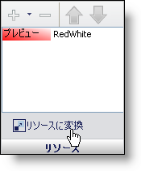
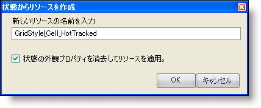
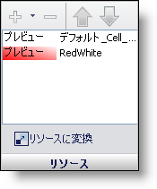

////

|metadata|
{
    "name": "styling-guide-converting-a-state-into-a-resource",
    "controlName": [],
    "tags": ["Styling","Theming"],
    "guid": "{59CC1C9F-AAAB-4526-97DD-39D996641126}",  
    "buildFlags": [],
    "createdOn": "0001-01-01T00:00:00Z"
}
|metadata|
////

= 状態をリソースに変換

UI ロールをスタイルする時、その他の UI ロールに適用したいスタイルを作成する可能性が最も高いです。いくつかの異なる状態に合わせてスタイルを作成し直すのではなく、スタイルをリソースに変換することができます。これで、このリソースを任意の UI ロールのその他の状態に適用できます。

=== 状態をリソースに変換するには、次の手順に従ってください。

[start=1]
. 任意の UI ロールの状態を選択します。
[start=2]
. ユーザーのアプリケーションのニーズに合わせて状態をスタイルします。
[start=3]
. [リソースに変換] をクリックします。

リソースの名前を要求するダイアログ ボックスが表示されます。 リソースに指定されるデフォルト名は常に  _StyleSet_UIRole_State_  となります。 この例で、スタイルセットは GridStyle、UI ロールは Cell、スタイルされる状態は HotTracked です。 状態の外観のプロパティをリセットして代わりにリソースを適用するオプションも提供されます。

[start=4]
. スタイル名の変更が完了したら、[OK] をクリックします。 新しいリソースが状態に追加され、外観のプロパティがリセットされます。

