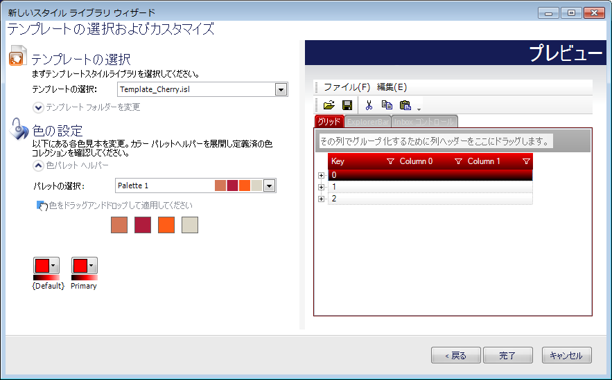
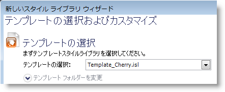
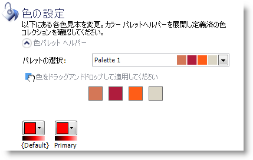

////

|metadata|
{
    "name": "styling-guide-creating-a-style-library-from-a-template",
    "controlName": [],
    "tags": ["Styling","Theming"],
    "guid": "{EA8E02E9-13ED-4FE8-B158-0C0DC277F4FE}",  
    "buildFlags": [],
    "createdOn": "0001-01-01T00:00:00Z"
}
|metadata|
////

= テンプレートからスタイル ライブラリを作成

[テンプレートから新しいスタイル ライブラリ] ダイアログ ボックスを使用して、数分で鮮やかな色と多様性を持つスタイル ライブラリをゼロから作成できます。開始するために必要なのは、以前に作成した Infragistics Style Library（.isl）ファイルのみです。スタイル ライブラリのカラー カテゴリーごとに基本の色を選択するだけで完了です。10 人のグラフィック デザイン チームが作成したようなスタイル ライブラリを作成します。テンプレート ライブラリから新しいスタイル ライブラリを作成する手順ごとのチュートリアルについては、以下の簡単な手順に従ってください。

[start=1]
. ファイル] メニューで、[新しいスタイル ライブラリ... をクリックし、次に [テンプレートから新しいスタイル ライブラリ] を選択します。
[start=2]
. テンプレートから新しいスタイル ライブラリ] ダイアログ ボックスが表示されます。

[start=3]
. ドロップダウン リストからテンプレートを選択します。ドロップダウン リストには AppStylist for Windows Forms の Template フォルダのデフォルトのテンプレートが含まれています。[テンプレート フォルダの変更] をクリックして、次にテンプレート フォルダ テキスト ボックスの右にある省略記号（...）をクリックすることによって、このテンプレート フォルダを変更できます。

[start=4]
. テンプレート スタイル ライブラリ] を選択した場合には、スタイル ライブラリ内に含まれる各カラー カテゴリー（カラー カテゴリー マネージャで作成される）の色ごとに [カラーを設定] セクションに見本が表示されます。スタイル ライブラリの理想の見栄えを最も表している色を選択します。色の選択で支援が必要な場合には、カラー パレット ヘルパーが適合する色を選択できます。

[start=5]
. これでテンプレート スタイル ライブラリと色を選択し、実行] ボタンをクリックすると、新しいスタイル ライブラリが作成されます。