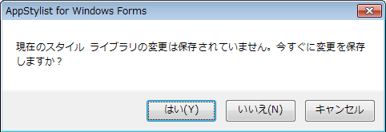

////

|metadata|
{
    "name": "styling-guide-creating-a-style-library",
    "controlName": [],
    "tags": ["Styling","Theming"],
    "guid": "{80E56B64-BF0B-4821-8DA2-6F1D7B878FE2}",  
    "buildFlags": [],
    "createdOn": "0001-01-01T00:00:00Z"
}
|metadata|
////

= スタイル ライブラリの作成

ひとつ以上のアプリケーションに複数のスタイル ライブラリを作成する必要がある場合、新しいスタイル ライブラリを作成する必要があります。AppStylist for Windows Forms を起動したばかりの場合には、[開始] ページが表示されます。[開始] ページの [最近のファイルを開く] セクションで、[新しいライブラリを作成] ボタンをクリックして、新しいスタイル ライブラリを作成できます。この方法を使用したくない場合は、以下の手順に従ってください。

*新しいスタイル ライブラリを作成するには、次の手順に従ってください。*

[start=1]
. [ファイル] メニューで、[新しいスタイル ライブラリ...] をクリックします（Ctrl+N を押すことで、新しいスタイル ライブラリを作成することも可能です）。
[start=2]
. 現在のスタイル ライブラリに保存されていない変更がある場合、ダイアログ ボックスがポップアップして、保存するかどうかを尋ねます。

** [はい] をクリックすると、これまでに保存されていない新しいスタイル ライブラリの場合には、[新規保存] ダイアログ ボックスが開きます。そうでない場合には、AppStylist が現在のスタイル ライブラリを保存して閉じて、新しいスタイル ライブラリを作成します。スタイル ライブラリの保存に関する詳細は、 link:styling-guide-saving-your-work.html[「作業の保存」]を参照してください。
** [いいえ] をクリックすると、現在のスタイル ライブラリに対する保存されていない変更が破棄され、新しいスタイル ライブラリが作成されます。
** [キャンセル] をクリックすると、新しいスタイル ライブラリの作成が中止されて、現在のスタイル ライブラリでの作業を続行できます。

[start=3]
. 新しいスタイル ライブラリが作成されて、 link:styling-guide-creating-a-styleset.html[スタイルセットの作成]を開始できます。