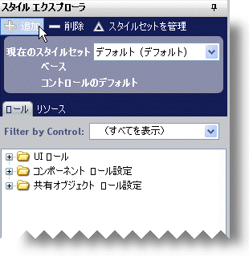
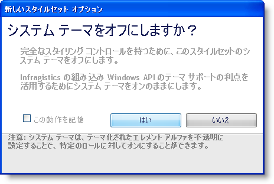
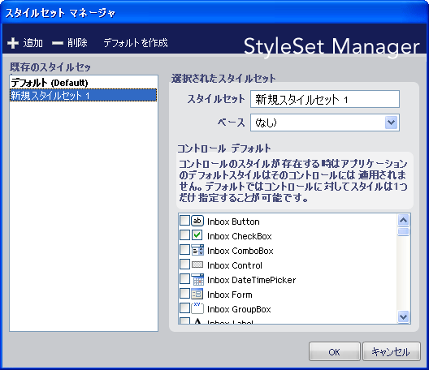
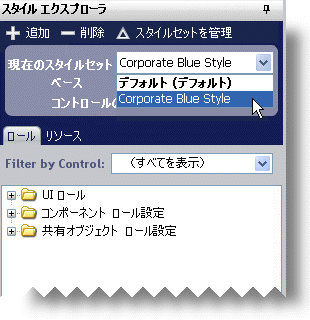

////

|metadata|
{
    "name": "styling-guide-creating-a-styleset",
    "controlName": [],
    "tags": ["Styling","Theming"],
    "guid": "{7836E050-1E36-429F-BDA1-0AA9F30527EB}",  
    "buildFlags": [],
    "createdOn": "0001-01-01T00:00:00Z"
}
|metadata|
////

= スタイルセットの作成

ひとつのスタイル ライブラリに、任意の数の Infragistics コントロールに適用される複数のスタイルセットを含むことができます。WinGrid 専用のスタイルセットを作成することもできますが、WinGrid と WinTree の両方に適用されるスタイルセットを作成することもできます。以前に作成されたスタイルセットを基にしてスタイルセットを作成することもできます。別のスタイルセットに基づいてスタイルセットを作成する場合、派生したスタイルセットで設定が明確に上書きされない限り、コントロールはすべての設定に「基となる」スタイルセットを使用します。以下の手順では、簡単なスタイルセットを作成してスタイル ライブラリに追加します。

*新しいスタイルセットを作成するには、次の手順に従ってください。*

[start=1]
. スタイル エクスプローラの一番上にあるツールバーで [新規追加] をクリックします。

link:styling-guide-infragistics-appstylist-for-windows-forms-options.html[Infragistics AppStylist オプション]によっては、システム テーマをオフにするようにプロンプトが表示される場合があります。独自のスタイルを作成したい場合には、[はい] をクリックして、オフにします。システム テーマを常にオフにしたい場合には、[このアクションを記憶] チェックボックスを選択します。

[start=2]
. [はい] をクリックして、オフにします。 link:styling-guide-styleset-manager-dialog-box.html[[スタイルセット マネージャ] ダイアログ ボックス]が表示されます。

[start=3]
. スタイルセット名を、「Corporate Blue Style」などのより分かりやすい名前に変更します。特定のコントロール/コンポーネントのみにスタイルセットが適用されるようにしたい場合、詳細は link:styling-guide-styling-a-specific-component-type.html[特定のコンポーネント デバイスをスタイル]を参照してください。
[start=4]
. [OK] をクリックして、スタイルセットをスタイル ライブラリに追加します。

「Corporate Blue Style」スタイルセットが [アクティブ スタイルセット] ドロップダウン リストに表示されます。

