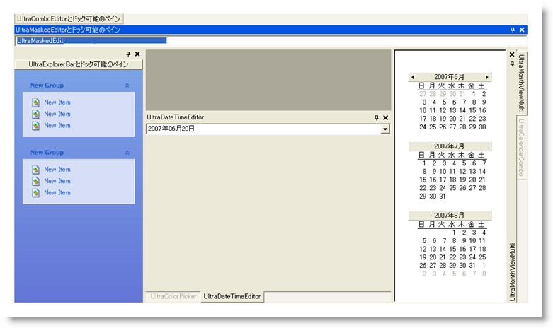

////

|metadata|
{
    "name": "styling-guide-dockmanager-canvas",
    "controlName": [],
    "tags": ["Styling","Theming"],
    "guid": "{8C8C4E8E-4DDF-4FA3-B10F-F4703EDDC195}",  
    "buildFlags": [],
    "createdOn": "0001-01-01T00:00:00Z"
}
|metadata|
////

= DockManager キャンバス

DockManager キャンバスに WinDockManager コンポーネントを伴うすべてのスタイリング修正を表示します。 このキャンバスには、ユーザー固有のアプリケーションで遭遇する可能性がある、複数の一般的な構成で WinDockManager コンポーネントが表示されます。 DockManager キャンバスに以下のコントロール/コンポーネントがあります。

* WinCalendarCombo
* WinColorPicker
* WinComboEditor
* WinDateTimeEditor
* WinDockManager
* WinExplorerBar
* WinMaskedEditor
* WinMonthViewMulti

ウィンドウがひとつも残っておらず、キャンバスが完全に空の時点に DockManager キャンバスを修正することは可能です。 開始時点の状態に DockManager キャンバスを戻す必要がある状況になった場合には、キャンバスの一番上にある [キャンバス オプション] ボタンをクリックして、[キャンバスをリセット] をクリックします。

DockManager キャンバスが元のレイアウトに戻ります。