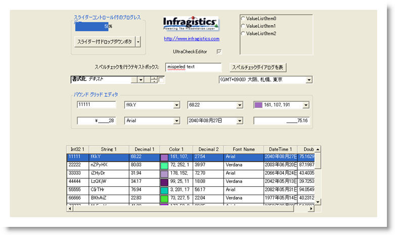

////

|metadata|
{
    "name": "styling-guide-editors-canvas",
    "controlName": [],
    "tags": ["Styling","Theming"],
    "guid": "{3D37F03E-71A5-4CA3-B5D4-0C158C69104F}",  
    "buildFlags": [],
    "createdOn": "0001-01-01T00:00:00Z"
}
|metadata|
////

= Editors キャンバス

Editors キャンバスに WinEditor コントロールを伴うすべてのスタイリング修正を表示します。 このキャンバスには、ユーザー固有のアプリケーションで遭遇する可能性がある、複数の一般的な構成で WinEditor コントロールが表示されます。 Editors キャンバスに以下のコントロール/コンポーネントがあります。

* WinButton
* WinCalculatorDropDown
* WinCheckEditor
* WinColorPicker
* WinComboEditor
* WinCurrencyEditor
* WinDateTimeEditor
* WinDropDownButton
* WinFontNameEditor
* WinFormattedLinkLabel

* WinGroupBox
* WinLabel
* WinMaskedEdit
* WinNumericEditor
* WinOptionSet
* WinPictureBox
* WinProgressBar
* WinSpellChecker
* WinTextEditor
* WinTimeZoneEditor

