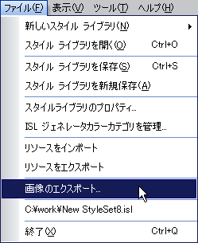
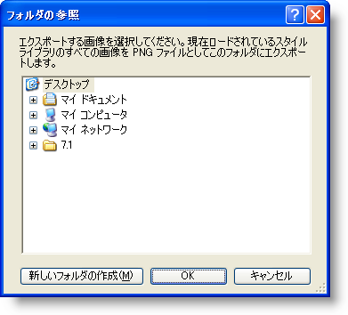
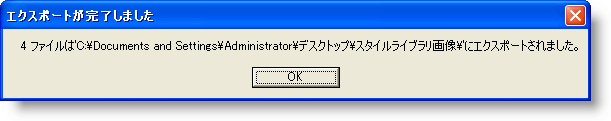

////

|metadata|
{
    "name": "styling-guide-exporting-images-from-a-style-library",
    "controlName": [],
    "tags": ["Styling","Theming"],
    "guid": "{E5DE124B-3DB6-41F0-9908-24C932BBDE8C}",  
    "buildFlags": [],
    "createdOn": "0001-01-01T00:00:00Z"
}
|metadata|
////

= スタイル ライブラリから画像をエクスポート

Infragistics Style Library（.isl）ファイルは、ImageBackground、ImageBackGroundDisabled、および Image プロパティに使用されるすべての画像を含み、スタイルセットそれぞれに関するすべての情報を便利に保管します。スタイル ライブラリをひとつの小さいパッケージに保管するために、すべての画像は .isl ファイルに組み込まれます。このためいくつかの小さい画像の配備を心配する必要はありません。誰か、おそらくは会社の別のグラフィック デザイナが異なるスタイル ライブラリのためにスタイル ライブラリのいずれかの画像を使用することが必要となるまではそれはそれで結構です。これは画像のエクスポートを支援する場所です。

[ファイル] メニューの [画像をエクスポート] を使用して、スタイル ライブラリのあらゆる画像を選択するフォルダにエクスポートできます。すべての画像はPortable Network Graphics（.png）ファイルとしてエクスポートされ、事前に決定したファイル名が指定されます。 ファイル名は、以下のように作成されます。

=== リソース

----
RESOURCE_<resource name>_<image property>
----

=== UI ロール

----
UIROLE_<StyleSet name>_<UI Role>_<State>_<image property>
----

*スタイル ライブラリから画像をエクスポートするには、次の手順に従ってください。*

[start=1]
. [ファイル] メニューで、[画像をエクスポート...] をクリックします。

[start=2]
. 画像を保管したいフォルダを指定します。

[start=3]
. フォルダを選択したら、[OK] をクリックして画像をエクスポートします。画像がエクスポートされ、ダイアログ ボックスが表示して、インポートされた画像の数と場所が通知されます。

