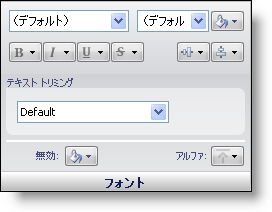

////

|metadata|
{
    "name": "styling-guide-font-pane",
    "controlName": [],
    "tags": ["Styling","Theming"],
    "guid": "{837B392C-B182-4894-9CB8-F190AC794B66}",  
    "buildFlags": [],
    "createdOn": "0001-01-01T00:00:00Z"
}
|metadata|
////

= フォント ペイン

[フォント] ペインはフォントのタイプ、サイズ、色、スタイル、配置を変更するオプションを提供します。無効な状態の色やアルファ レベルだけでなく、テキスト トリミングも使用できます。

*フォント タイプ* – フォント タイプ ドロップダウンボックスを使用して、特定の状態が使用するフォントを選択します。

*フォント サイズ* – フォント サイズ ドロップダウン ボックスを使用して、この状態でフォントをどの程度の大きさで表示するかを選択します。ドロップダウン ボックスにリストされないフォントを選択する必要がある場合は、フォント サイズ ボックスに数字を入力するだけです。

*フォント カラー* – [フォント カラー] ボタンによって、特定の状態のフォントの色を選択できます。

*フォント スタイル* – 4 つのボタンで、フォントを太字、斜体、下線、取り消し線のいずれにするかを選択できます。

*配置* – このグループの最初のボタンによって、テキストの垂直方向の配置を選択できます。テキストは垂直方向に上、中、下に配置できます。このグループの 2 番目のボタンによって、テキストの水平方向の配置を選択できます。テキストは水平方向に左、中央、右に配置できます。

*テキスト トリミング* – [テキスト トリミング] ドロップダウン ボックスによって、領域に収まらないテキストの処理方法を指定できます。

*無効* – [無効] ボタンによって、状態が無効になった時のフォントの色を選択できます。

*アルファ* – [アルファ] ボタンによって、フォントに [その他] ペインの [アルファ レベル] を使用するか、不透明または透明に表示するかを選択できます。

