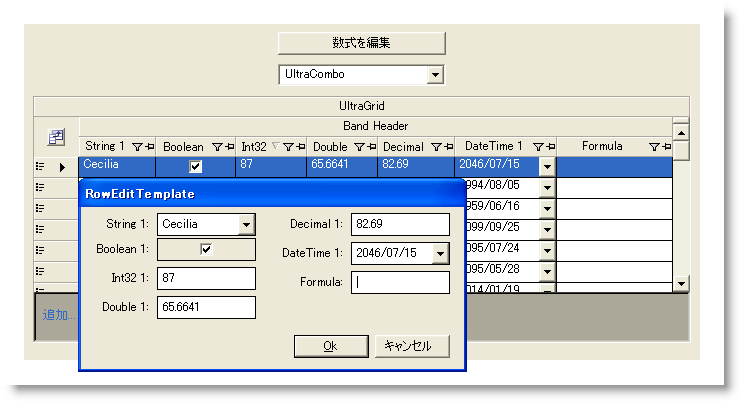

////

|metadata|
{
    "name": "styling-guide-grid-canvas",
    "controlName": [],
    "tags": ["Grids","Styling","Theming"],
    "guid": "{A7D57462-20BF-4657-83C4-DDE3F54716C6}",  
    "buildFlags": [],
    "createdOn": "0001-01-01T00:00:00Z"
}
|metadata|
////

= Grid キャンバス

Grid キャンバスに WinGrid™ コントロールを伴うすべてのスタイリング修正を表示します。このキャンバスには、ユーザー固有のアプリケーションで遭遇する可能性がある、複数の一般的な構成で WinGrid コントロールが表示されます。Grid キャンバスで以下のコントロール/コンポーネントを見つけることができます。

* WinCombo™
* WinDropDown™
* WinGrid
* WinGridCellProxy™ (行エディタ テンプレートで)
* WinGridRowEditTemplate™

Grid キャンバスにはグリッドの表示方法に影響を及ぼす特別なキャンバス オプションがあります。

[cols="a,a"]
|====
|image::images/AppStyling_Grid_Canvas_02.png[] 

|*外観* 

* *表示* -- エンド ユーザーは WinGrid のデータを複数の異なる方法で表示できます。選択した表示によって、グリッドのレイアウトを大幅に変更できます（つまりカード表示）。 

* *その他* -- このセクションには、グリッドの表示方法に影響を及ぼすさまざまなオプションが含まれます。使用する [表示] によって、一部のオプションは使用できない場合があります（'GroupBy' ボックスの表示は OutlookGroupBy 表示でしか使用できません）。これらのほとんどのオプションによって、視覚的エレメントを表示または非表示にすることができます。 

|image::images/AppStyling_Grid_Canvas_03.png[] 

|*機能* 

* *フィルタリング* -- 可能な場合には、エンド ユーザーはグリッドをフィルタリングして特定の方法でデータを表示することができます。このボックスをチェックすると行をフィルタリングできます。HeaderIcons オプションを選択すると、行のヘッダーにフィルタ アイコンを付けることができます。FilterRow を選択すると、フィルタできる行を表示します。 

* *集計* -- グリッドは、各列のデータの集計を表示できます。このボックスをチェックすると集計を作成できます。集計を表示する場所を、列の一番上、一番下、または GroupBy 行のみの中から選択することができます。 

* *新しい行* -- [行の追加を許可] を選択することで、エンド ユーザーは新しい行をグリッドに追加できます。[AddRow] ボックスまたは [AddNew] ボックスを表示したい場合には選択できます。 

|====