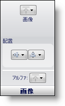

////

|metadata|
{
    "name": "styling-guide-image-pane",
    "controlName": [],
    "tags": ["Styling","Theming"],
    "guid": "{F865CEA6-CF69-4244-A176-213CD845D60C}",  
    "buildFlags": [],
    "createdOn": "0001-01-01T00:00:00Z"
}
|metadata|
////

= 画像ペイン

[画像] ペインによって、適宜現在の状態に画像を設定できます。いったん設定したら、画像を水平方向または垂直方向に配置できます。画像のアルファ レベルを設定することも可能です。

*画像* – [画像] ボタンをクリックすることによって、状態の前景に使用する画像を設定できます。ドロップダウン メニューから [ファイル] を選択すると、[ファイルを開く] ダイアログ ボックスが表示されます。

*配置* – このグループの最初のボタンによって、画像の垂直方向の配置を選択できます。画像は垂直方向に上、中、下に配置できます。このグループの 2 番目のボタンによって、画像の水平方向の配置を選択できます。画像は水平方向に左、中央、右に配置できます。

*アルファ* – [アルファ] ボタンによって、フォントに [その他] ペインの [アルファ レベル] を使用するか、不透明または透明に表示するかを選択できます。

