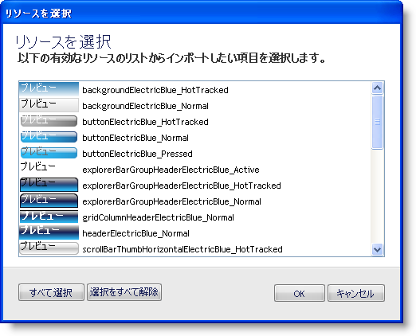
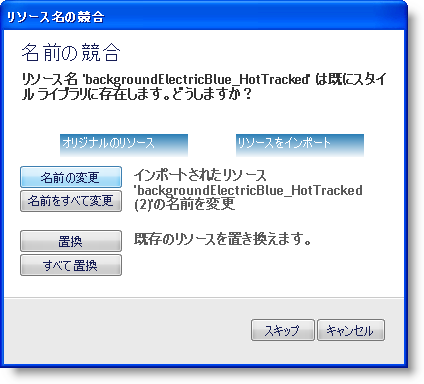

////

|metadata|
{
    "name": "styling-guide-importing-and-exporting-resources",
    "controlName": [],
    "tags": ["Exporting","Styling","Theming"],
    "guid": "{F2A5C483-DA6A-4350-8153-F5D5C11623FA}",  
    "buildFlags": [],
    "createdOn": "0001-01-01T00:00:00Z"
}
|metadata|
////

= リソースのインポートとエクスポート

Infragistics AppStylist for Windows Forms は、スリム化した Infragistics Style Library（.isl）ファイルとして、現在のスタイル ライブラリにあるすべてのリソースをエクスポートできます。エクスポートされたリソース ファイルは、基本の .isl ファイルとして同じフォーマットで保存されますが、リソース情報のみが保存されます。いったんエクスポートされたら、エクスポートされたリソースを任意のその他のスタイル ライブラリにインポートできます。AppStylist は既存のリソースとインポートしたリソースをマージします。

=== リソースをエクスポートするには、次の手順に従ってください。

[start=1]
. [ファイル] メニューで、[リソースをエクスポート] をクリックします。[新規保存] ダイアログ ボックスが表示されます。
[start=2]
. エクスポートされたリソース ファイルに名前を指定します。
[start=3]
. [保存] をクリックします。

=== リソースをインポートするには、次の手順に従ってください。

[start=1]
. [ファイル] メニューで、[リソースをインポート] をクリックします。[スタイル ライブラリを開く] ダイアログ ボックスが表示されます。
[start=2]
. リソースをエクスポートしたフォルダを指定します。
[start=3]
. ダイアログ ボックスからエクスポートしたリソース ファイルを選択します。
[start=4]
. [開く] をクリックします。[リソースを選択] ダイアログ ボックスが表示されます。

デフォルトで、すべてのリソースが選択されます。[すべての選択を解除] ボタンをクリックして、すべてのリソースの選択を解除します。リソースをクリックする間 Ctrl キーを押し続けることによって、一度に複数のリソースを選択できます。
[start=5]
. インポートしたいリソースを選択したら、[OK] をクリックします。

スタイル エクスプローラの [リソース] タブから [インポート] ボタンと [エクスポート] ボタンを使用することによって、リソースをインポートおよびエクスポートすることもできます。

image::images/AppStyling_Importing_and_Exporting_Resources_01.png[]

=== リソース名の競合

インポートしようとするリソース名がスタイル ライブラリにすでにあるリソースと同じ名前の場合、名前の競合を解決することを求めて [リソース名の競合] ダイアログ ボックスが表示されます。

リソース名の競合を処理するときに使用できるオプションは 5 つあります。

* AppStylist でインポートしたリソース名を変更したい場合には、[名前を変更] をクリックします。AppStylist は、名前の最後に "(2)" を追加することによって、常にリソース名を変更します。
* 上記の規則ですべてのインポートしたリソース名を変更したい場合は、[すべての名前を変更] をクリックします。
* [置き換え] をクリックすることで既存のリソースを新しいリソースと置き換えることができます。
* [すべてを置き換え] をクリックすることで、すべての既存のリソースをすべての新しいリソースと置き換えることも可能です。
* [スキップ] をクリックすることによって、現在のリソースをスキップして、リストの次のリソースに移動するオプションもあります。