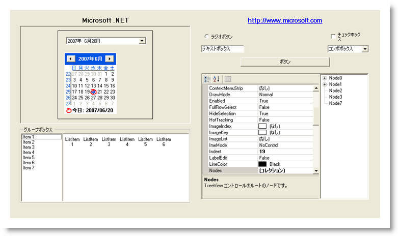

////

|metadata|
{
    "name": "styling-guide-inboxcontrols-canvas",
    "controlName": [],
    "tags": ["Styling","Theming"],
    "guid": "{17D927BF-782A-48F6-83D2-1F185BE0DBA5}",  
    "buildFlags": [],
    "createdOn": "0001-01-01T00:00:00Z"
}
|metadata|
////

= InboxControls キャンバス

InboxControl キャンバスに Inbox コントロールを伴うすべてのスタイリング修正を表示します。 このキャンバスには、複数の一般的な構成で Inbox コントロールが表示されます。 InboxControls キャンバスに以下のコントロールがあります。

* Button
* CheckBox
* ComboBox
* DateTimePicker
* GroupBox
* Label
* LinkLabel
* ListBox

* ListView
* MonthCalendar
* Panel
* PropertyGrid
* RadioButton
* TextBox
* TreeView
* UserControl

