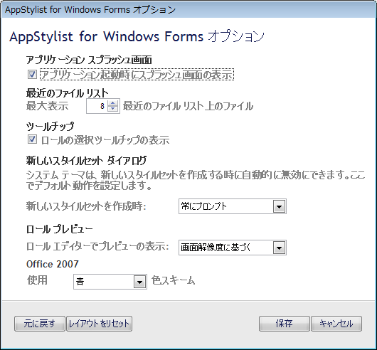

////

|metadata|
{
    "name": "styling-guide-infragistics-appstylist-for-windows-forms-options",
    "controlName": [],
    "tags": ["Styling","Theming"],
    "guid": "{DCCF8C94-E528-4816-9A51-47DE99E36417}",  
    "buildFlags": [],
    "createdOn": "0001-01-01T00:00:00Z"
}
|metadata|
////

= AppStylist for Windows Forms オプション ダイアログ ボックス

[AppStylist オプション] ダイアログ ボックスでオプションを変更することによって、複数の主要な AppStylist for Windows Forms の機能をカスタマイズできます。画像の下に各オプションを詳細に説明します。

* *アプリケーションのスプラッシュ画面* -- AppStylist を起動すると、貴重なアプリケーション情報とともにスプラッシュ画面が表示します。この情報には、現在使用している AppStylist のバージョン情報と AppStylist のステータスが含まれています。チェックボックスの選択が解除されると、AppStylist はアプリケーション起動の間スプラッシュ画面を表示しなくなります。
* *最近のファイルのリスト* -- [最近のファイルのリスト] は [ファイル] メニューと [開始] ページの [最近のファイルを開く] セクションの両方にあります。このリストは、AppStylist で最近開いたすべてのファイルを表示します。最大 99 の最新ファイルを表示できます。
* *ツールチップ* -- 異なるキャンバスのコントロール上にマウスを移動すると、ロール選択のツールチップが表示されます。使用可能な異なる UI ロールのことを良く知っている場合には、キャンバス全体が常に表示されるようにツールチップをオフにした方がいい場合があります。ツールチップをオフにするには、チェックボックスの選択を解除します。
* *新しいスタイルセット ダイアログ* -- 新しいスタイルセットを作成する時に、そのスタイルセットのシステム テーマをオフにするプロンプトを表示するように AppStylist を構成できます。システム テーマを無効にしたい場合には、ドロップダウン リストから [テーマをオフにする] を選択します。システム テーマを常に有効にする場合は、ドロップダウン リストから [テーマをオンにしておく] を選択します。システム テーマをオフにすることは、コントロールとコンポーネントをスタイルする時の重要な手順です。システム テーマをオフにしない場合は、スタイルの多くが表示されません。
* *ロールのプレビュー* -- モニターの解像度が低く設定されている場合、AppStylist のユーザー インターフェイスで多くの領域を確保できない場合があります。このオプションによって、ロール エディタの [プレビュー] ペインを非表示にできます（[リソース] ペインがないため、リソース エディタに [プレビュー] ペインが常に表示されます）。[プレビュー] ペインを常に非表示にするまたは表示するように AppStylist を構成できます。または、画面解像度の基づいて [プレビュー] ペインを自動的に非表示または表示するように AppStylist を設定できます。
* *Office 2007* -- Office 2007のルックアンドフィールは3つの色（青、黒、シルバー）スキームでサポートされてます。プロパティパネルの共有コンポーネントプロパティにあるViewStyleプロパティをOffice2007に設定した場合、このテーマをサポートしている全てのコンポーネントはこのドロップダウンボックスで特定された色を使用することになります。