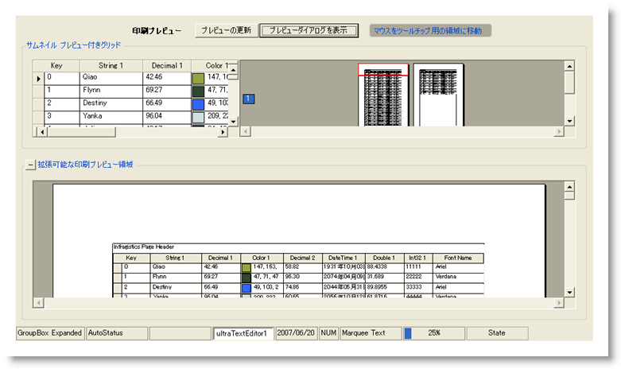

////

|metadata|
{
    "name": "styling-guide-misc-canvas",
    "controlName": [],
    "tags": [],
    "guid": "{C431B29C-8515-49FF-A175-B6A101E13804}",  
    "buildFlags": [],
    "createdOn": "0001-01-01T00:00:00Z"
}
|metadata|
////

= Misc キャンバス

Misc キャンバスに Misc コントロールを伴うすべてのスタイリング修正を表示します。 このキャンバスには、複数の一般的な構成で Misc コントロールが表示されます。 Misc キャンバスに以下のコントロールがあります。

* WinButton
* WinExpandableGroupBox
* WinGrid
* WinLabel
* WinPrintPreviewControl
* WinPrintPreviewThumbnail
* WinStatusBar
* WinTooltip

