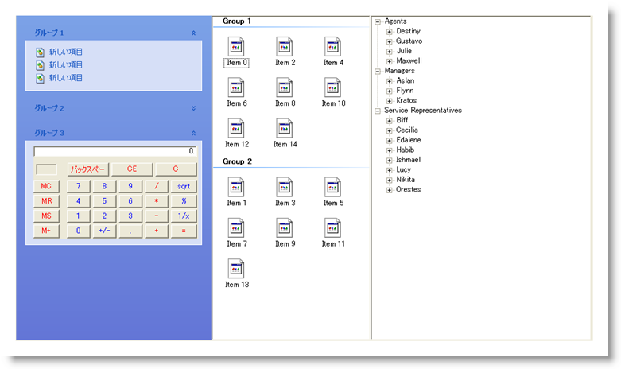

////

|metadata|
{
    "name": "styling-guide-navigation-canvas",
    "controlName": [],
    "tags": ["Styling","Theming"],
    "guid": "{07949128-D532-4A95-8A60-64670336E664}",  
    "buildFlags": [],
    "createdOn": "0001-01-01T00:00:00Z"
}
|metadata|
////

= Navigation キャンバス

Navigation キャンバスに Navigation コントロールを伴うすべてのスタイリング修正を表示します。 このキャンバスには、複数の一般的な構成で Navigation コントロールが表示されます。 Navigation キャンバスに以下のコントロールがあります。

* WinCalculator
* WinExplorerBar
* WinListView
* WinTree

キャンバスの一番上にある [キャンバス オプション] をクリックして、複数のキャンバス オプションにアクセスできます。 以下の任意のオプションを選択すると、ExplorerBar、ListView および Tree の外観がそれぞれ変更します。

[cols="a,a,a"]
|====
|image::images/AppStyling_Navigation_Canvas_02.png[] 

|image::images/AppStyling_Navigation_Canvas_03.png[] 

|image::images/AppStyling_Navigation_Canvas_04.png[] 

|====