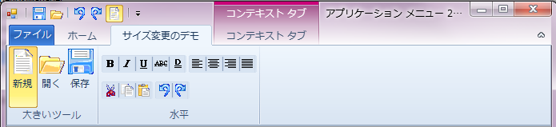
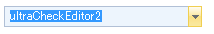

////

|metadata|
{
    "name": "styling-guide-office-2010-look-and-feel",
    "controlName": [],
    "tags": ["Styling","Theming"],
    "guid": "97099817-8dda-4627-9188-2f482502992d",  
    "buildFlags": [],
    "createdOn": "2010-09-22T19:36:02.3984502Z"
}
|metadata|
////

= Office 2010 のルック アンド フィール

{ProductName} 2010 Volume 3 では、コントロールに新しいルック アンド フィール（Microsoft® Office 2010 のルック アンド フィール）が追加されました。このルック アンド フィールは、青、黒、シルバーの 3 つの個別の色が含まれるという意味でユニークです。これらのテーマは、静的な Infragistics.Win.Office2010ColorTable. link:{ApiPlatform}win{ApiVersion}~infragistics.win.office2010colortable~colorscheme.html[ColorScheme] プロパティから Infragistics® フレームワークで実現されます。

すべての WinEditor コントロールは、DisplayStyle プロパティによって Office 2010 ルック アンド フィールをサポートします。WinButton、WinScrollBar などのボタンの UIElement を使用するいくつかのコントロールと、ほとんどの WinEditors は ButtonStyle プロパティによってこのルック アンド フィールをサポートします。このコントロール自体は、ViewStyle プロパティを通して Office 2010 のルック アンド フィールを活用できます。

Office 2010 カラー テーブル - Office2010 スタイルで使用されるすべての色を管理するために新しい link:{ApiPlatform}win{ApiVersion}~infragistics.win.office2010colortable.html[Office2010ColorTable] を追加しました。Office2010ColorTable オブジェクトの ColorScheme プロパティを使用してカラー スキームを変更できます。 デフォルトで、カラー スキームは Blue に設定されます。これらのカラースキームの設定にはひとつのプロパティの設定が必要ですが、Office 2010 ルック アンド フィールを使用するアプリケーションのすべてのコントロールがこのカラー スキームを指定します。他で黒のカラー スキームを使用中に青のカラー スキームを使用するコントロールを使用できません。以下のコードは、アプリケーション全体で Office 2010 カラー スキームを黒に変更します。

*Visual Basic の場合：*

----
Infragistics.Win.Office2010ColorTable.ColorScheme = 
Infragistics.Win.Office2010ColorScheme.Black
----

*C# の場合：*

----
Infragistics.Win.Office2010ColorTable.ColorScheme =
  Infragistics.Win.Office2010ColorScheme.Black;
----

*デフォルト スタイル* - DisplayStyle プロパティを Office2010 に設定することによって、Office 2010 のルック アンド フィールを以下のコントロールに適用できます。

* WinCalculatorDropDown™
* WinColorPicker™
* WinCombo™
* WinComboEditor™
* WinCurrencyEditor™
* WinDateTimeEditor™
* WinFontNameEditor™
* WinMaskedEdit™
* WinNumericEditor™
* WinTextEditor™
* WinTimeZoneEditor™
* WinToolTipManager™
* WinTimeSpanEditor™

====== WinFontNameEditor

image::images/Office_2010_Look_and_Feel_01.png[]

*ビュー スタイル* - ViewStyle プロパティを Office2010 に設定することによって、以下のコントロールに Office 2010 のルック アンド フィールを適用できます。

* WinToolbarsManager ( link:{ApiPlatform}win.ultrawintoolbars{ApiVersion}~infragistics.win.ultrawintoolbars.ultratoolbarsmanager~style.html[Style])

====== WinToolbarsManager

* WinScrollBar™
* *ScrollBarLook.ViewStyle* - 以下のコントロールに影響します。

** WinExplorerBar™
** WinCombo™
** WinGrid™
** WinListView™
** WinTree™

*グリフ スタイル* - WinCheckEditor コントロールと WinOptionSet コントロールも Office2010 のルック アンド フィールをエミュレートします。

====== WinCheckEditor

*ボタン スタイル* - ButtonStyle プロパティを Office2010 に設定することによって、以下のコントロールに Office 2010 のルック アンド フィールを適用できます。

* WinCalculatorDropdown™
* WinColorPicker™
* WinCombo™
* WinComboEditor™
* WinCurrencyEditor™
* WinDateTimeEditoR™
* WinFontNameEditor™
* WinMaskedEdit™
* WinNumericEditor™
* WinTimeZoneEditor™
* WinButton™
* WinDropDownButton™
* WinCheckEditor™
* WinScrollBar™

====== WinScrollBar

image::images/Office_2010_Look_and_Feel_04.png[]