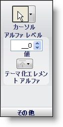

////

|metadata|
{
    "name": "styling-guide-other-pane",
    "controlName": [],
    "tags": ["Styling","Theming"],
    "guid": "{6062B2D7-9724-446A-9DC6-B135B511C3CB}",  
    "buildFlags": [],
    "createdOn": "0001-01-01T00:00:00Z"
}
|metadata|
////

= その他のペイン

[その他] ペインには、状態の上にマウスを移動したときのカーソルの外観、状態のアルファ レベル、テーマ化されたエレメント アルファなどのオプションが含まれています。

*カーソル* – マウスが現在の状態の上に移動したときに使用するために、カーソルの多数のタイプから選択します。

*アルファ レベル* – アルファ レベルは、0 から 255 に設定できます。[背景]、[境界線]、[フォント]、[画像] のすべてのペインには、このアルファ レベルを使用するオプションがあります。 アルファ レベルが 0 に設定されると、現在の状態は表示されなくなります。 レベルが増えると、アルファ レベル 255 で完全に表示されるまでますます見えるようになります。

*テーマ化されたエレメント アルファ* – [テーマ化されたエレメント アルファ] は、[背景]、[境界線]、[フォント]、[画像] の各ペインの [アルファ] ボタンとまったく同じように動作しますが、UseOsThemes プロパティが True に設定されるときにはテーマ化されたエレメントのみに適用されます。 [テーマ化されたエレメント アルファ] を [透明] に設定すると、特定の UI ロールに対するテーマ化を事実上オフにします。

