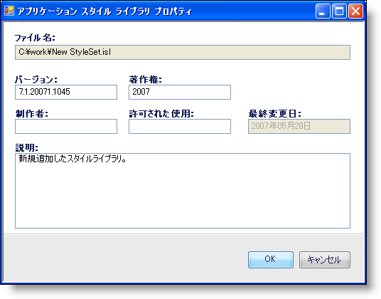

////

|metadata|
{
    "name": "styling-guide-personalizing-your-style-library",
    "controlName": [],
    "tags": ["Styling","Theming"],
    "guid": "{E8B95F24-24C8-4978-ADEE-BB03946B532B}",  
    "buildFlags": [],
    "createdOn": "0001-01-01T00:00:00Z"
}
|metadata|
////

= スタイル ライブラリのパーソナライズ

[アプリケーション スタイル ライブラリ] プロパティ ダイアログ ボックスによって、固有の個人情報を使用して固有のスタイル ライブラリにタグを付けることができます。この情報には、名前、著作権年、または希望する場合にはエンド ユーザー ライセンス契約までも含めることができます。

[アプリケーション スタイル ライブラリ] プロパティ ダイアログ ボックスにアクセスするには、[ファイル] メニューを開き、[スタイル ライブラリ プロパティ...] をクリックします。以下のような画像が表示して、スタイル ライブラリのパーソナライズを開始できます。

* *ファイル名* -- このフィールドは、現在のスタイル ライブラリの場所を識別します。このフィールドは修正できません。
* *バージョン* -- スタイル ライブラリの現在のバージョンを入力します。このフィールドはブランクにしておくことができます。
* *著作権* -- このフィールドには、他の著作権を表すテキストとともに、著作権の年または年の期間を入力します。
* *制作者* -- このフィールドに名前または会社名、またはスタイル ライブラリを作成した人物を特定するその他の名前を入力します。
* *許可される**使用* -- このスタイル ライブラリを誰でもが自由に修正できる場合、このフィールドにその情報を配置します。
* *最新**更新日* -- このフィールドは、このスタイル ライブラリが最後に保存された日にちを識別します。このフィールドは修正できません。
* *説明* -- スタイル ライブラリの説明、画像が組み込まれる場合には使用する色、またはスタイル ライブラリを使用または修正する人への特別な指示を提供します。