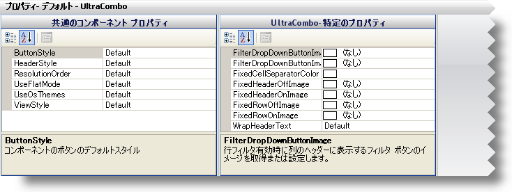
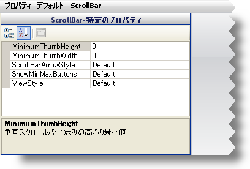
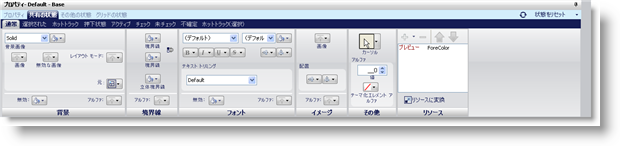
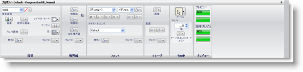

////

|metadata|
{
    "name": "styling-guide-properties-panel",
    "controlName": [],
    "tags": ["Design Environment","Styling","Theming"],
    "guid": "{E6E70EA7-4836-412F-94EB-9DFD8635E67B}",  
    "buildFlags": [],
    "createdOn": "0001-01-01T00:00:00Z"
}
|metadata|
////

= プロパティ パネル

プロパティ パネルは、数種類の外観プロパティを修正する場所です。プロパティ パネルは実際的には共有コンテナで、コンポーネント ロール エディタ、共有オブジェクト ロール エディタ、UI ロール エディタ、リソース エディタがあります。ロール ツリーで選択するロールによって、さまざまなエディタが表示します。デフォルトで、AppStylist for Windows Forms ユーザー インターフェイスの一番下にプロパティ パネルが配置されます。ただし、ユーザー インターフェイスのその他の複数の場所に配置するオプションがあります。

== コンポーネント ロール エディタ

コンポーネント ロール エディタは、スタイル エクスプローラのロール ツリーで任意のコンポーネント ロールを選択すると、2 つのプロパティ ウィンドウを表示します。これらのプロパティ ウィンドウは、すべてのコンポーネント ロールに共通するプロパティと、特定のコンポーネント ロールに固有のプロパティを表示します。詳細は、 link:styling-guide-roles.html[ロール]のトピックの「コンポーネント ロールの設定」を参照してください。

== 共有オブジェクト ロール エディタ

共有オブジェクト ロール エディタは、コンポーネント ロール エディタと視覚的には同じに表示されます。いずれのエディタも外観プロパティを設定するためにプロパティ ウィンドウを使用します。唯一の違いは、共有オブジェクト ロール エディタのプロパティ ウィンドウがコンポーネント ロール エディタよりもひとつ少ないことです。詳細は、 link:styling-guide-roles.html[ロール]のトピックの「共有オブジェクト ロール」を参照してください。

== UI ロール エディタ

UI ロール エディタは、コンポーネント ロール エディタや共有オブジェクト ロール エディタとは非常に異なった外観プロパティを表示します。UI ロール エディタは、他の 2 つのエディタよりもグラフィカルなインタフェースを持ち、スタイル エクスプローラのロール ツリーから UI ロールを選択したときに限って表示されます。UI ロール エディタの外観プロパティは、修正するすべての UI ロールのあらゆる状態で同じです。修正するあらゆる状態は同じ外観プロパティのセットを持っています。ただし、これらのプロパティは特定の状態に限って影響します。詳細は、 link:styling-guide-role-editor.html[ロール エディタ] のトピックを参照してください。

== リソース エディタ

リソース エディタはロール エディタに非常に似ています。2 つの主な違いは、プロパティ パネルの一番上近くにタブ付きのインタフェースがないことと、[リソース] ペインが非表示であることです。スタイル エクスプローラで [リソース] タブをクリックして、リソースを選択することによって、リソース エディタにアクセスできます。現在のスタイル ライブラリに一切リソースが含まれない場合、リソースの作成方法の詳細は link:styling-guide-applying-a-resource-to-a-state.html[「リソースを状態に適用」]を参照してください。

