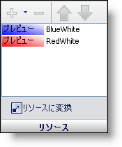

////

|metadata|
{
    "name": "styling-guide-resources-pane",
    "controlName": [],
    "tags": ["Styling","Theming"],
    "guid": "{B187D197-DB13-42F4-8046-CA0EA5AA9839}",  
    "buildFlags": [],
    "createdOn": "0001-01-01T00:00:00Z"
}
|metadata|
////

= リソース ペイン

[リソース] ペインを使用して、状態をリソースに変換するだけでなく、リソースを状態に追加することができます。

*＋ および - ボタン*  – + ボタンをクリックすると、リソースを状態に追加します。- ボタンをクリックすると、リソースを状態から削除します。詳細は link:styling-guide-applying-a-resource-to-a-state.html[「リソースを状態に適用」]を参照してください。

*上および下矢印*  – あるリソースが別のリソースよりもリストで上位にある場合、その設定はリストで下位にあるリソースよりも優先されます。たとえば、BlueWhite リソースは青/白のグラデーションを背景に適用します。RedWhite リソースは赤/白のグラデーションを背景に適用します。BlueWhite リソースが RedWhite リソースよりもリストで上位にあるため、状態は背景で青/白のグラデーションになります。ただし、RedWhite リソースを選択して上矢印をクリックするだけで、赤/白のグラデーションを背景に適用できます。

*リソースに変換*  – [リソースに変換] をクリックすると、現在の状態の外観プロパティを取得して、これらのプロパティからリソースを作成します。詳細は link:styling-guide-converting-a-state-into-a-resource.html[「状態をリソースに変換」]を参照してください。

