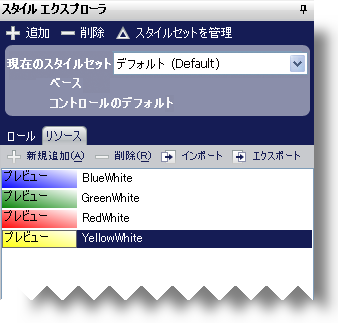

////

|metadata|
{
    "name": "styling-guide-resources",
    "controlName": [],
    "tags": ["Styling","Theming"],
    "guid": "{25808FCE-34DE-480B-877C-6CAFE53E65E8}",  
    "buildFlags": [],
    "createdOn": "0001-01-01T00:00:00Z"
}
|metadata|
////

= リソース

スタイル エクスプローラの [リソース] タブによって、スタイル ライブラリに現在保管されているすべてのリソースを管理できます。リソースは任意の UI ロールの任意の状態に適用可能なスタイル情報のための役に立つコンテナです。[リソース] タブで、リソースをインポートおよびエクスポートするだけでなくリソースを追加および削除するために、以下のボタンをクリックすることができます。

* *新規追加*  – このボタンをクリックして新しいリソースを作成します。いつでもリソース名を変更できます。
* *削除* – このボタンをクリックして、スタイル ライブラリから永久にリソースを削除します。
* *インポート* – このボタンをクリックして、[スタイル ライブラリを開く] ダイアログ ボックスを起動して、ロードする .isl ファイルを選択します。リソースのインポートに関する詳細は、 link:styling-guide-importing-and-exporting-resources.html[「リソースのインポートとエクスポート」]を参照してください。
* *エクスポート* – このボタンをクリックして、[スタイル ライブラリを保存] ダイアログ ボックスを起動して、エクスポートしたリソースのファイル名を選択します。リソースのエクスポートに関する詳細は、 link:styling-guide-importing-and-exporting-resources.html[「リソースのインポートとエクスポート」]を参照してください。

修正するリソースを選択したら、画面の下側にあるリソース エディタで外観プロパティを変更できます。リソース エディタは UI ロール エディタに似ています。唯一の違いは [リソース] ペインが削除されていることです。リソースに関する詳細は、 link:styling-guide-using-resources-with-stylesets.html[「スタイルセットとリソースを使用」]を参照してください。

