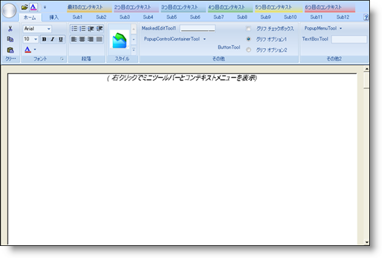

////

|metadata|
{
    "name": "styling-guide-ribbon-canvas",
    "controlName": [],
    "tags": ["Styling","Theming"],
    "guid": "{0F775164-4820-4D85-9B15-70A93ABF5147}",  
    "buildFlags": [],
    "createdOn": "0001-01-01T00:00:00Z"
}
|metadata|
////

= Ribbon キャンバス

Ribbon キャンバスに Ribbon を伴うすべてのスタイリング修正を表示します。このキャンバスには、ユーザー固有のアプリケーションで遭遇する可能性がある、複数の一般的な構成で Ribbon が表示されます。Ribbon キャンバスで以下のコントロールを見つけることができます。

* WinToolbarsManager (Ribbon を含む)
* WinFormattedTextEditor
* WinStatusBar
* WinTooltip

