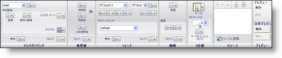

////

|metadata|
{
    "name": "styling-guide-roles",
    "controlName": [],
    "tags": ["Styling","Theming"],
    "guid": "{A1944766-A4BB-45EF-A95B-A436C619CFE5}",  
    "buildFlags": [],
    "createdOn": "0001-01-01T00:00:00Z"
}
|metadata|
////

= ロール

ロール ツリーは、アプリケーション スタイリングが提供するさまざまなタイプのロールをナビゲートするときに役立ちます。ロールすべてにアプリケーションの見栄えに影響を及ぼす可能性がある何らかの外観の変更が含まれているため、これらのロールはアプリケーションのスタイリングにおいて極めて重要な役割を果たします。

== UI ロール

UI ロールは、ユーザー インターフェイスで果たすロールにちなんで名前が付けられています。UI ロールには、ボタン、ラベル、またはユーザーがアプリケーションで見ることができるその他のグラフィックのエレメントが含まれる場合があります。これらの UI ロールは継承ごとに一意に分類されています。初めて UI Role ノードを展開すると、Base UI Role が表示されます。Base UI Role に対して外観の変更を行うと、すべての UI ロールは Base の子であるため、すべての UI ロールがこれらの変更を継承します。ただし、Base を展開して Button UI Role を修正すると、これらの修正は Base を上書きします。修正されたプロパティのみが上書きされます。すべての修正されていないプロパティは Base から継承されます。

UI ロールをクリックすると、スタイル エクスプローラの下にあるプロパティ パネルが、その特定の UI ロールに使用可能なすべての状態を表示するタブ付きインタフェースが付いて表示されます。

[プロパティ] タブをクリックして、特定の UI ロールの境界線とボタン スタイルを設定します。[一般]、[その他]、[グリッド] の各状態によって、UI ロールの個々の状態を選択できます。状態を選択すると、 link:styling-guide-role-editor.html[ロール エディタ]で UI ロールの外観を編集することが可能となります。

状態が修正されると、ロール ツリーの UI ロール名だけでなく、タブの状態の名前が太字になり、デフォルトのオプションが変更されたことを通知します。

== コンポーネント ロールの設定

AppStylist for Windows Forms は Infragistics® コントロールおよびコンポーネントをスタイルする機能を提供するだけでなく、インボックス コンポーネントをスタイルすることもできます。インボックス コントロールのスタイリングに関する詳細は、{ProductName} ヘルプの「開発者向けガイド」の「InboxControlStyler コンポーネントについて」を参照してください。インボックス、または Infragistics のいずれであっても、各コンポーネントにはその他のコンポーネントに似たプロパティのグループがあり、さらに個々のコンポーネント固有のプロパティのグループもあります。一般的なコンポーネントのプロパティまたはコンポーネント固有のプロパティのいずれを設定するときでも、行う変更の影響は現在のコンポーネントに限定されることを理解することが重要です。

=== 一般的なコンポーネントのプロパティ

[一般的なコンポーネントのプロパティ] ウィンドウには、UseOsThemes や UseFlatMode などのプロパティが含まれています。これらのプロパティについて理解していないと、アプリケーションのスタイルでトラブルになる場合があります。たとえば UseOsThemes は、True に設定されると、UI ロール エディタで修正可能ないくつかの外観プロパティを上書きするプロパティです。各コンポーネントにはこれらのプロパティ設定があり、これらを設定した場合の影響は現在のコンポーネントに限定されます。

[一般的なコンポーネントのプロパティ] ウィンドウ特有のもうひとつのプロパティは ResolutionOrder です。ResolutionOrder によって、アプリケーション スタイリングとコントロールのプロパティを解決する順番を定義できます。たとえば、ResolutionOrder を ApplicationThenControl に設定すると、開発者が Microsoft® Visual Studio® で行ったプロパティ設定を使用してコントロールをレンダリングし、次に AppStylist で設定されたプロパティ設定を使用してコントロールをレンダリングします。AppStylist で行われるプロパティ設定は、Visual Studio で行われるすべての設定を上書きします。ResolutionOrder を ControlThenApplication に設定すると全く反対となり、Visual Studio で開発者が行う設定で、すべての AppStylist のプロパティ設定が上書きされます。ResolutionOrder を ControlOnly に設定することも可能で、基本的にアプリケーション スタイリングを完全にオフにします。

=== コンポーネント固有のプロパティ

コンポーネント固有のプロパティは、その特定のコンポーネントのこのプロパティ ウィンドウに限って存在するプロパティです。コンポーネントによっては、このプロパティ ウィンドウに同じプロパティを持っている場合がありますが、そのプロパティが影響を及ぼすのはその特定のコンポーネントに限定されます。

== 共有オブジェクト ロールの設定

Shared Object Role Settings ノードには多数のコンポーネント間で共有される複数のオブジェクトが含まれます。共有オブジェクトの好例は、埋め込みエディタです。エディタのいくつかは、EditorWithCombo、EditorWithMask、および EditorWithText などの基本クラスから派生します。これらの共有オブジェクトはこれらの基本クラスを使用する任意のコントロール/コンポーネントに適用されます。ひとつのコンポーネントを作成するために共有オブジェクトを使用できるとしても、基本オブジェクトは依然として別のコンポーネントの一部として使用できます。コンポーネント ロールの設定と共有オブジェクト ロールの設定の違いは、コンポーネント ロールを設定するときに、そのコンポーネントのみに影響を及ぼすことです。共有オブジェクト ロールを設定すると、その共有オブジェクト ロールを使用するすべてのコントロール/コンポーネントに影響を及ぼします。