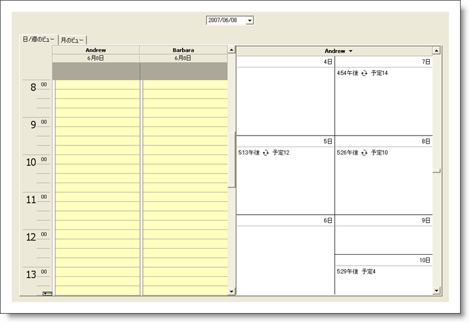

////

|metadata|
{
    "name": "styling-guide-schedule-canvas",
    "controlName": [],
    "tags": ["Scheduling","Styling","Theming"],
    "guid": "{58D7C784-8BBB-4F16-8921-9FDB6598FDF1}",  
    "buildFlags": [],
    "createdOn": "0001-01-01T00:00:00Z"
}
|metadata|
////

= Schedule キャンバス

Schedule キャンバスに WinSchedule コントロールを伴うすべてのスタイリング修正を表示します。 このキャンバスには、ユーザー固有のアプリケーションで遭遇する可能性がある、複数の一般的な構成で WinSchedule コントロールが表示されます。 Schedule キャンバスに以下のコントロールがあります。

* WinCalendarCombo
* WinDayView
* WinMonthViewMulti
* WinMonthViewSingle
* WinWeekView

