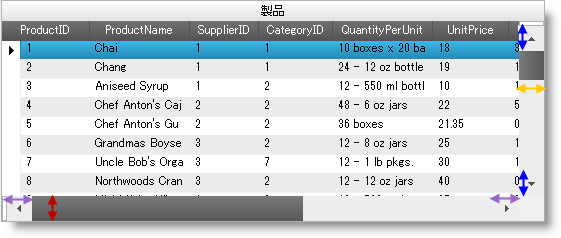

////

|metadata|
{
    "name": "styling-guide-scrollbar-resizing",
    "controlName": [],
    "tags": [],
    "guid": "3ab17f95-570c-48ce-bedd-36f7799cafe9",  
    "buildFlags": [],
    "createdOn": "2012-09-15T18:39:49.7759763Z"
}
|metadata|
////

= スクロールバーのサイズ変更

== トピックの概要

=== 目的

このトピックはスクロールバーのサイズ変更機能を説明し、サイズ変更可能な Infragistics コントロールをリストし、新しい機能のプロパティを紹介するコード例を提供します。

== 概要

=== スクロールバー サイズ変更の概要

スクロールバー サイズ変更機能は、Infragistics コントロールでスクロールバーおよびスクロールバーの矢印のサイズをタッチスクリーンで変更することが可能になります。デザイナーよよび開発社は、垂直および水平スクロールバーの幅、および垂直スクロールバー矢印の幅をカスタムに指定できます。

Infragistics WinGrid コントロールに適用されたこの画像はスクロールバーのサイズ変更機能です。スクロールバーおよび矢印を既定サイズから拡大できることをご確認できます。青の矢印は、垂直スクロール矢印の高さの展開を示します。オレンジの矢印は、垂直スクロールバーの幅の拡大を示します。紫の矢印は、水平スクロール矢印の高さの展開を示します。赤の矢印は、水平スクロールバーの高さの拡大を示します。

== アプリケーション レベルでスクロールバーをサイズ変更

=== 概要

Application Styling Framework で Scrollbar オブジェクトの Shared Object Role 設定を変更すると、アプリケーション内のすべての Infragistics コントロールのスクロールバーとそれに付随する矢印のサイズ変更が可能になります。Application Styling Framework および Shared Object Role 設定の詳細については、トピックの最後の <<_RelatedContent,関連コンテンツ>> セクションを参照してください。

=== プロパティ設定

以下の表は、最適なスクロールバーおよび矢印のサイズを対応するプロパティ設定にマップします。

[options="header", cols="a,a,a"]
|====
|目的:|使用するプロパティ:|設定の選択肢 (ピクセル) :

|垂直スクロールバーにシステムのデフォルト幅を使用します。
|VerticalScrollBarWidth
|0 (デフォルト値)

|画像の幅 (ピクセル単位) を取得します。たとえば、垂直幅を 24 ピクセルにする場合、プロパティを 45 に設定します。
|VerticalScrollBarWidth
|45

|水平スクロールバーにシステムのデフォルトの高さを使用します。
|HorizontalScrollBarHeight
|0 (デフォルト値)

|垂直スクロールバーの高さ (ピクセル単位) を設定します。たとえば、垂直の高さを 45 ピクセルにする場合、プロパティを 45 に設定します。
|HorizontalScrollBarHeight
|45

|水平スクロールバー矢印にシステムのデフォルトの幅を使用します。
|HorizontalScrollBarArrowWidth
|0 (デフォルト値)

|水平スクロールバー矢印の幅 (ピクセル単位) を設定します。たとえば、水平スクロールバーの矢印を 25 ピクセルにする場合、プロパティを 25 に設定します。
|HorizontalScrollBarArrowWidth
|25

|垂直スクロールバー矢印にシステムのデフォルトの高さを使用します。
|VerticalScrollBarArrowHeight
|0 (デフォルト値)

|垂直スクロールバーの高さ (ピクセル単位) を設定します。たとえば、垂直スクロールバーの矢印を 25 ピクセルにする場合、プロパティを 25 に設定します。
|VerticalScrollBarArrowHeight
|25

|====

=== 図

以下のスクリーンショットは、上記の表で指定されたプロパティ設定で構成された AppStylist for Windows Forms のインターフェイスです。

[cols="a,a"]
|====
|image::images/Scrollbar_Resizing_2.png[]|image::images/Scrollbar_Resizing_3.png[]

|====

== 各コントロール レベルでスクロールバーをサイズ変更

=== 概要

コントロールの ScrollBarLook オブジェクトでプロパティを直接設定すると、各Infragistics コントロールでスクロールバーおよび矢印のサイズ変更が可能です。

ScrollBarLook オブジェクトは、コントロール レベル直下のコントロールの API または DisplayLayout または CalendarLook オブジェクトなど他のオブジェクトのサブ プロパティに位置します。以下の表は、ScrollBarLook オブジェクトの場所を簡単に参照できます。

[options="header", cols="a,a"]
|====
|コントロール|ScrollBarLook オブジェクトの場所。

|WinCombo, WinDropDown, WinGrid, WinGridColumnChooser
|DisplayLayout のサブ プロパティ。

|WinCalendarCombo, WinDayView, WinMonthViewMulti, WinMonthViewSingle, WinSchedulePrintDocument, WinTimelineView, WinWeekView
|CalendarLook のサブ プロパティ。

|スクロールバーのある他のすべての Infragistics コントロール。
|コントロール レベル

|====

=== プロパティ設定

以下の表は、最適なスクロールバーおよび矢印のサイズをプロパティ設定にマップします。

[options="header", cols="a,a,a"]
|====
|目的:|使用するプロパティ:|設定の選択肢 (ピクセル) :

|垂直スクロールバーにシステムのデフォルト幅を使用します。
|ScrollBarLook.VerticalScrollBarWidth
|0 (デフォルト値)

|画像の幅 (ピクセル単位) を取得します。たとえば、垂直スクロールバーの幅を 45 ピクセルにする場合、 45 にプロパティを設定します。
|ScrollBarLook.VerticalScrollBarWidth
|45

|水平スクロールバーにシステムのデフォルトの高さを使用します。
|ScrollBarLook.HorizontalScrollBarHeight
|0 (デフォルト値)

|垂直スクロールバーの高さ (ピクセル単位) を設定します。たとえば、垂直のスクロールバーの高さを 45 ピクセルにする場合、プロパティを 45 に設定します。
|ScrollBarLook.HorizontalScrollBarHeight
|45

|水平スクロールバー矢印にシステムのデフォルトの幅を使用します。
|ScrollBarLook.HorizontalScrollBarArrowWidth
|0 (デフォルト値)

|水平スクロールバー矢印の幅 (ピクセル単位) を設定します。たとえば、水平スクロールバー矢印の幅を 25 ピクセルにする場合、 25 にプロパティを設定します。
|ScrollBarLook.HorizontalScrollBarArrowWidth
|25

|垂直スクロールバー矢印にシステムのデフォルトの高さを使用します。
|ScrollBarLook.VerticalScrollBarArrowHeight
|0 (デフォルト値)

|垂直スクロールバーの高さ (ピクセル単位) を設定します。たとえば、垂直スクロールバー矢印の幅を 25 ピクセルにする場合、 25 にプロパティを設定します。
|ScrollBarLook.VerticalScrollBarArrowHeight
|25

|====

== コード例: WinGrid のスクロールバーおよびスクロールバー矢印のサイズの設定

=== 説明

この例では、スクロールバーおよびスクロールバー矢印の高さおよび幅の各ディメンションを 30 ピクセルにコードで設定します。

=== コード

このコードは、“MyGrid” という名の WinGrid のスクロールバーおよびスクロールバー矢印を幅および高さを 30 ピクセルにします。

*C# の場合:*

[source,csharp]
----
this.MyGrid.DisplayLayout.ScrollBarLook.VerticalScrollBarWidth = 30;
 this.MyGrid.DisplayLayout.ScrollBarLook.VerticalScrollBarArrowHeight = 30;
this.MyGrid.DisplayLayout.ScrollBarLook.HorizontalScrollBarHeight = 30;
this.MyGrid.DisplayLayout.ScrollBarLook.HorizontalScrollBarArrowWidth = 30;
----

[[_RelatedContent]]
== 関連コンテンツ

=== トピック

このトピックについては、以下のトピックも参照してください。

[options="header", cols="a,a"]
|====
|トピック|目的

| link:styling-guide.html[アプリケーションのスタイリング]
|このトピックは、スタイル アプリケーションのフレームワークに関連するトピックを参照します。

| link:styling-guide-roles.html[ロール、共通オブジェクト ロール、設定セクション]
|Application Styling Framework ドキュメンテーション内のサブ トピックは、複数のコントロールに影響のあるスタイルの設定について説明します。

|====