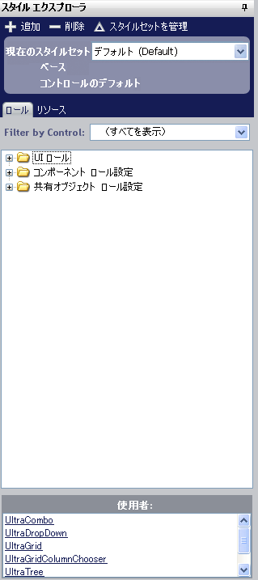

////

|metadata|
{
    "name": "styling-guide-style-explorer",
    "controlName": [],
    "tags": ["Styling","Theming"],
    "guid": "{9DB9303D-0828-4565-9A54-4B6C655EF708}",  
    "buildFlags": [],
    "createdOn": "0001-01-01T00:00:00Z"
}
|metadata|
////

= スタイル エクスプローラ

スタイル エクスプローラはその名前が意味するとおりの機能でユーザーを支援します。すなわちデフォルトおよびカスタムのスタイルを探索します。スタイル エクスプローラによって、すべてのスタイルを追加、削除および管理することができ、ほとんどのこれらのアクションで必要なのはマウスをワンクリックするだけです。

[新規追加] ボタンをクリックして、スタイルセット マネージャを開きます（スタイルセット マネージャの詳細は link:styling-guide-creating-a-styleset.html[「スタイルセットの作成」]を参照してください）。スタイルセット マネージャは、新しいスタイルセットをすでに作成した状態で開きます。[削除] ボタンをクリックして、現在のスタイル ライブラリから選択したスタイルセットを即座に削除します。[スタイルセットを管理] をクリックすると、再度 link:styling-guide-styleset-manager-dialog-box.html[スタイルセット マネージャ]が開きますが、今回は新しいスタイルセットは作成されません。

スタイル エクスプローラで、ロールを指定しリソースを管理することも可能です。

* link:styling-guide-roles.html[ロール] – [スタイル] タブの下に、UI Roles、Component Role Settings、そして Shared Object Role Settings という 3 つの主要なノードを持つツリーがあります。コンポーネントでツリーをフィルタリングして、ひとつのコンポーネントに基づいて UI Roles、Component Role Settings、および Shared Object Role Settings のみを表示することができます。ツリーの下には、選択したロールについての役立つ情報を含むパネルがあります。この情報には、どのロールが選択されているか、またその他のどのコンポーネントがそのロールを使用するかが含まれます。
* link:styling-guide-resources.html[リソース] – [リソース] タブの下に、[新規追加] と [削除] という 2 つのボタンがあります。[新規追加] ボタンは新しいリソースをスタイル ライブラリに追加します。これで UI ロールのスタイルを修正するのと全く同じようにリソースの外観を編集できます。[削除] ボタンは選択したリソースを削除します。

