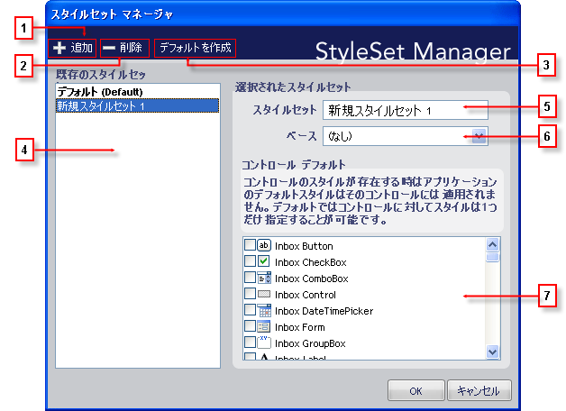

////

|metadata|
{
    "name": "styling-guide-styleset-manager-dialog-box",
    "controlName": [],
    "tags": ["Styling","Theming"],
    "guid": "{A5ACCA34-C5BF-41BE-B377-11565D2072B2}",  
    "buildFlags": [],
    "createdOn": "0001-01-01T00:00:00Z"
}
|metadata|
////

= スタイルセット マネージャ ダイアログ ボックス

スタイルセット マネージャを使用して、便利な 1 個所からすべてのスタイルセットを管理します。 スタイルセット マネージャは、現在のスタイル ライブラリにスタイルセットを追加および削除するだけでなく、その他の複数のタスクを実行することができます。 以下は、[スタイルセット マネージャ] ダイアログ ボックスのスクリーンショットで、各オプションの説明を表示しています。

[start=1]
. *新規追加* – このボタンをクリックして、新しいスタイルセットを作成し現在のスタイル ライブラリに追加します。 ボタンをクリックすると、新しいスタイルセットが作成され「新しいスタイルセット #」 という名前が指定されます（[新規作成] ボタンを使用してスタイルセットを作成するたびに「#」は自動的に増えます）。
[start=2]
. *削除* – [削除] をクリックして、スタイル ライブラリから選択したスタイルセットを永久に削除します。 [スタイルセットを削除] ダイアログ ボックスには、選択したスタイルセットを削除したいかどうかを尋ねるメッセージが表示されます。 [はい] をクリックしてスタイルセットを削除します。 [いいえ] をクリックしてスタイルセットを保持します。
[start=3]
. *デフォルトを作成* – あらゆるコンポーネントは、そのコンポーネントが固有のデフォルトを持っていない限り、デフォルトのスタイルセットを自動的に使用します。 スタイル ライブラリごとに指定できるデフォルトのスタイルセットはひとつだけです。 デフォルトのスタイルセットを変更するには、デフォルトとして設定したいスタイルセットを選択して [デフォルトを作成] をクリックします。 新しいデフォルトのスタイルセットが括弧の中に「デフォルト」という語に続いて太字のテキストで表示されます。
[start=4]
. *既存のスタイルセット* – 現在のスタイル ライブラリに存在するすべてのスタイルセットがこのリストに表示されます。 デフォルトのスタイルセットが括弧の中に「デフォルト」という語に続いて太字のテキストで表示されます。
[start=5]
. *スタイルセット名* – このテキスト ボックスには、選択したスタイルセット名が表示されます。 このテキスト ボックスを使用して、スタイルセット名を編集します。
[start=6]
. *ベースのスタイルセット* – 別のスタイルセットに基づいてスタイルセットを作成したい場合には、別のスタイルセットをベースにして作成したいスタイルセットを選択し、次にドロップダウン リストからベースにしたいスタイルセットを選択します。 たとえば、「デフォルト」をベースにして「新しいスタイルセット 1」を作成したい場合、[既存のスタイルセット] リストで「新しいスタイルセット 1」を選択してから、[ベースのスタイルセット] ドロップダウンリストから「デフォルト」を選択します。 これで「新しいスタイルセット 1」は「新しいスタイルセット 1」で特に上書きされない限り、すべてのデフォルトのスタイル情報を使用します。
[start=7]
. *コントロールのデフォルト* – ひとつまたは複数のコンポーネントでデフォルトのスタイルセットを作成できます。 特定のコンポーネントにデフォルトのスタイルセットがある場合、スタイル ライブラリのデフォルトのスタイルセットの代わりにそのスタイルセットを使用します。 ひとつのコンポーネントが持つことができるデフォルトのスタイルセットはひとつだけです。 コンポーネントにすでにデフォルトのスタイルセットがあるときに、デフォルトのスタイルセットを設定しようとする場合には、そのコンポーネントのデフォルトのスタイルセットを変更するかどうかを尋ねるダイアログ ボックスが開きます。