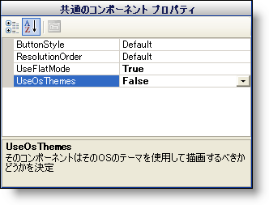
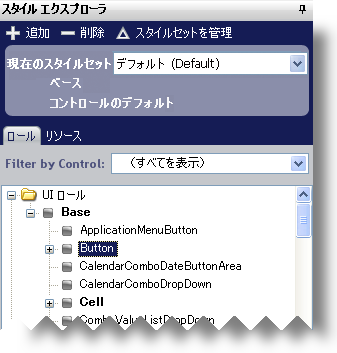
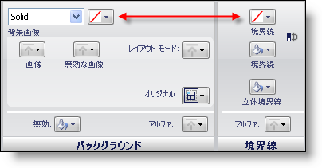
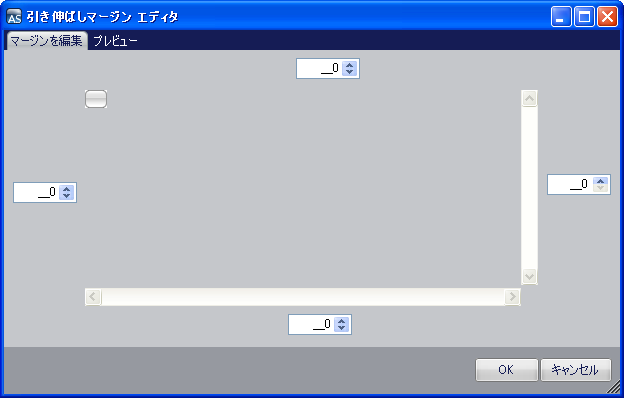

////

|metadata|
{
    "name": "styling-guide-styling-a-button",
    "controlName": [],
    "tags": ["How Do I","Styling","Theming"],
    "guid": "{19337BC6-8A00-4CBB-9AAA-DABE01FE9A75}",  
    "buildFlags": [],
    "createdOn": "0001-01-01T00:00:00Z"
}
|metadata|
////

= ボタンのスタイリング

この詳細なガイドは、スタイル ライブラリの作成、ボタンのスタイリング、そのスタイル ライブラリの保存というプロセスを説明します。 この手順ごとのチュートリアルが終わるまでに、Infragistics AppStylist for Windows Forms がどのように機能するかを正しく理解することができます。

この詳細なガイドを十分に活用するためには、ハードディスクに保存されている以下の画像が必要となります。 各画像をマウスの右ボタンでクリックして、ショートカット メニューから [コピー] を選択します。 これらの画像を好きな画像編集アプリケーションに貼り付けて（Microsoft® Paint は問題なく動作します）、以下の表の推奨されたファイル名を使用します。

[options="header", cols="a,a"]
|====
|画像|保存するファイル名

|image::images/Button.png[]
|Button.png

|image::images/Button_HotTracked.png[]
|Button_HotTracked.png

|image::images/Button_Pressed.png[]
|Button_Pressed.png

|====

[start=1]
. *新しいスタイル ライブラリの作成*

.. [ファイル] メニューで、[新しいスタイル ライブラリ] をクリックします。 新しいスタイル ライブラリが作成されます。

[NOTE]
====
*注:* 新しいスタイルが WinButton コントロールのみに適用されるようにしたい場合には、WinButton をターゲットとした新しいスタイルセットを作成する必要があります。 特定のコンポーネントをターゲットとすることに関する詳細は、 link:styling-guide-styling-a-specific-component-type.html[特定のコンポーネント デバイスをスタイル]を参照してください。 ただし、この詳細なガイドでは、デフォルトのスタイルセットを使用します。
====

[start=2]
. *UltraButton に対してコンポーネント ロールの設定を設定します。*

.. スタイル エクスプローラで [ロール] タブをクリックします。
.. Component Role Settings ノードを展開します。
.. Infragistics Components ノードを展開します。
.. UltraButton を選択します。
.. [一般的なコンポーネントのプロパティ] で、UseFlatMode を True に設定し、UseOsThemes を False に設定します。

[start=3]
. *ボタン UI ロールで [ノーマル] の状態に指定します。*

.. スタイル エクスプローラで、UI Roles ノードを展開します。
.. Base ノードを展開します。
.. ボタン UI ロールを選択します。

.. link:styling-guide-role-editor.html[ロール エディタ]で [一般の状態] タブの下の [ノーマル] 状態が選択されていることを確認します。

[start=4]
. *ボタン UI ロールのノーマル状態をスタイルします。*

.. 背景の塗りつぶしと境界線の両方の色を [透明] に設定します。

.. [背景] ペインで、[画像] をクリックして、ドロップダウン リストから [ファイル] を選択します。
.. 3 つのボタン画像を保存した場所をナビゲートして Button.png を開きます。

[NOTE]
====
*注:* 表示されているキャンバスによって、ボタンの外観の変更をすぐに確認することができます。 変更を表示するための理想的なキャンバスは、 link:styling-guide-editors-canvas.html[Editors キャンバス]です。 キャンバス領域の一番上にある [Editors] タブをクリックして、Editors キャンバスに切り替えます。 キャンバスを表示する支援が必要な場合には、 link:styling-guide-canvas.html[「キャンバス」]のトピックを参照してください。
====

.. [背景] ペインで、[レイアウト モード] をクリックして、ドロップダウン リストから [引き伸ばし] を選択します。 [レイアウト モード] ボタンの下に [マージン] ボタンが表示します。
.. [マージン] をクリックします。 [引き伸ばしマージン エディタ] が表示します。

.. 左、上、右、下のマージンを5、4、5、4にそれぞれ設定します。

[NOTE]
====
*注:* マージンを試したい場合は、[プレビュー] タブをクリックします。 現在設定されている引き伸ばしマージンを使用して手動で画像を引き伸ばすことができます。
====

.. [OK] をクリックします。

キャンバス上のいくつかのボタンが思ったとおりの外観にならない場合があります。 [スペルチェック ダイアログを表示] ボタンは、スライダ ボタンの付いた DropDownButton とは外観が異なります。 これは UltraButton コンポーネントのみに UseFlatMode を設定したが、ボタン UI ロールをスタイルしたためです。 ボタン UI ロールは UltraButton コンポーネントだけでなく、アプリケーションのすべてのボタンに影響を及ぼします。 その他のコンポーネントがボタン UI ロールを使用しているため、スタイル エクスプローラの [ロール] タブにある Component Role Settings ノードに戻り、[すべてのコンポーネント] を選択します。 UseFlatMode を True に、UseOsThemes を False に設定します。 アプリケーションのすべてのボタンが同じように表示されます。
[start=5]
. *ボタン UI ロールの HotTracked 状態をスタイルします。*

.. プロパティ パネルで、[HotTracked] タブをクリックします。

.. 手順 4 を実行しますが、Button_HotTracked.png 画像を Button.png 画像の代わりにします。

[start=6]
. *ボタン UI ロールの Pressed 状態をスタイルします。*

.. プロパティ パネルで、[Pressed] タブをクリックします。

.. 手順 4 を実行しますが、Button_Pressed.png 画像を Button.png 画像の代わりにします。

[start=7]
. *スタイル ライブラリを保存します。*

.. [ファイル] メニューから、[スタイル ライブラリを保存...] をクリックします。[スタイル ライブラリを保存] ダイアログ ボックスが表示します。
.. ファイル名に Button.isl を使用します。
.. [保存] をクリックします。

スタイル ライブラリがアプリケーションで使用される準備がこれで整いました。 スタイル ライブラリを使用するためには、アプリケーションの Main メソッドにコードを 1 行追加する必要があります。 スタイル ライブラリのロードに関する詳細は、{ProductName} ヘルプの「開発者向けガイド」の「スタイル ライブラリのロード」を参照してください。