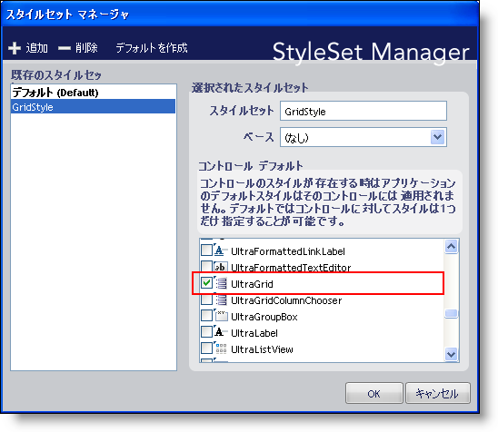
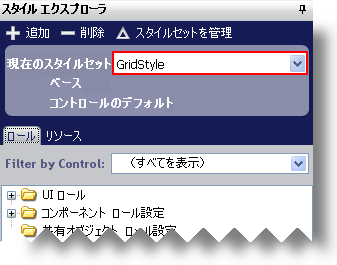
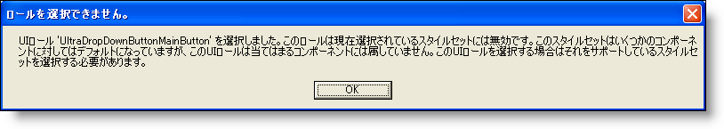

////

|metadata|
{
    "name": "styling-guide-styling-a-specific-component-type",
    "controlName": [],
    "tags": ["How Do I","Styling","Theming"],
    "guid": "{8BA81E2F-3FF0-42ED-99C1-85F0468495C8}",  
    "buildFlags": [],
    "createdOn": "0001-01-01T00:00:00Z"
}
|metadata|
////

= 特定のコンポーネント デバイスをスタイル

WinGrid などのひとつのコントロール/コンポーネント タイプに特定のスタイルを適用したい場合があります。これを実行するには、WinGrid 専用のスタイルセットを作成する必要があります。アプリケーション開発者が特定のコンポーネント用のスタイルセットを含むスタイル ライブラリをロードすると、あらゆるコントロール/コンポーネントはデフォルトのスタイルセットを使用しますが、特定のコンポーネントはそのコンポーネントをターゲットとしたスタイルセットを使用します。

[NOTE]
====
*注:* この特定のタイプのすべてのコントロール/コンポーネントはこのターゲットとしたスタイルセットによってスタイルされます。ただし、開発者が UseAppStyling プロパティを使用してそのコントロール/コンポーネントの特定のインスタンスに対してアプリケーション スタイリングを無効にした場合を除きます。
====

このトピックは、WinGrid コントロールのための新しいスタイルセットを作成する手順について説明します。

[start=1]
. [開始] ページで [新しいライブラリを作成] をクリックする、または [ファイル]、[新しいスタイル ライブラリ] をクリックすることによって、新しいスタイル ライブラリを作成します。新しいスタイル ライブラリが作成されます。
[start=2]
. スタイル エクスプローラで、[新規追加] をクリックします。

image::images/AppStyling_Styling_a_Particular_Component_01.png[]

スタイルセット マネージャが表示します。
[start=3]
. GridStyle などの名前を新しいスタイルセットに指定します。UltraGrid の横のチェックボックスを選択していることを確認します。これによって、スタイルセットが WinGrid コントロールのみに適用されることを保証します。

[start=4]
. [OK] をクリックします。GridStyle スタイルセットが現在アクティブなスタイルセットです。

GridStyle は WinGrid のみに適用されるため、[コントロールでフィルタリング] ドロップダウン リストには、UltraGrid しか含まれていません。したがって、WinGrid に適用される UI ロールのみがスタイル エクスプローラに表示されます。また、ロールは UltraGrid によってすでにフィルタリングされているため、UI ロール ツールチップには [コンポーネントでフィルタリング] オプションが表示されません。現在アクセスできないツールチップからコンポーネントを選択しようとする場合、その特定のコンポーネントをサポートする異なるスタイルセットを使用しなければならないことを通知するダイアログ ボックスが表示されます。

その特定のコンポーネントをスタイルしたい場合には、[アクティブ スタイルセット] ドロップダウン リストから [デフォルトのスタイルセット] を選択するだけです。これですべてのコンポーネントを再度スタイルすることができるようになります。