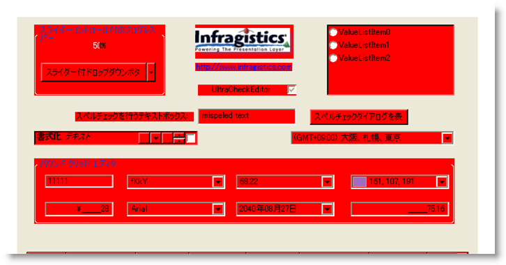
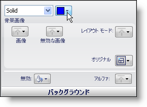
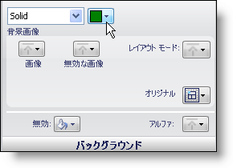
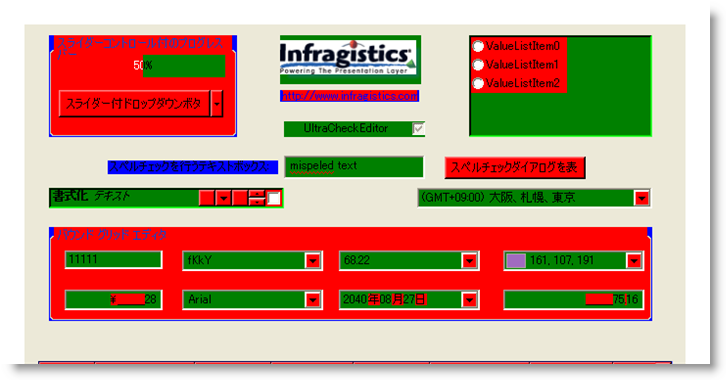

////

|metadata|
{
    "name": "styling-guide-styling-ui-roles-using-inheritance",
    "controlName": [],
    "tags": ["Styling","Theming"],
    "guid": "{5B80B448-7561-4EBA-883C-0EB0AA71DA72}",  
    "buildFlags": [],
    "createdOn": "0001-01-01T00:00:00Z"
}
|metadata|
////

= 継承を使用して UI ロールをスタイル

Infragistics AppStylist for Windows Forms は相互に継承されるコンポーネントの複数の異なる部分をスタイルすることができます。UI ロール ツリーの最上位レベルにあるのが Base UI Role です。これをスタイルすることは基本的にすべてのスタイル可能なコンポーネントのすべての側面（つまりすべての UI ロールのすべての Appearance オブジェクト）をスタイルすることになります。Base UI Role の背景色を赤に変更してみましょう。

*外観がすべてのコンポーネントによって継承される UI ロールのスタイリング*

[start=1]
. 新しいスタイル ライブラリで、スタイル エクスプローラの [ロール] タブをクリックします。
[start=2]
. UI Roles ノードを展開します。
[start=3]
. Base をクリックします。
[start=4]
. 背景色を赤に設定します。

image::images/AppStyling_Styling_Shared_Areas_01.png[]

異なるキャンバスを見てみると、すべてのスタイル可能な UI ロールの背景が赤になっていることが分かります。Base UI Role はすべてのスタイル可能なコンポーネントによって継承されます。つまり、すべての UI ロールは Base から継承します。

ControlArea などの Base の下の UI ロールの背景色を変更するのであれば、このような赤には表示されません。ControlArea UI ロールの背景色を青に変更してみましょう。

*外観が一部のコンポーネントによって継承される UI ロールのスタイリング*

[start=1]
. スタイル エクスプローラの [ロール] タブで Base ツリー ノードを展開します。
[start=2]
. リストで、ControlArea を選択します。
[start=3]
. 背景色を青に設定します。

異なるキャンバスをもう一度見ると、特に Editors キャンバスで、赤と青の「スーパーマン」のようになっていることに気づきます。Base の背景は赤に設定されたままですが、ControlArea UI ロールは Base UI ロールを上書きします。

image::images/AppStyling_Styling_Shared_Areas_04.png[]

新たなレベルでスタイル継承をドリルダウンすると、EditorControl UI ロールをスタイルできます。これを実行すると、エディタ タイプのコントロール（たとえば Editors キャンバスのコントロール）にある ControlAreas のみに影響を及ぼします。ただし、すべての Editor ControlAreas をスタイルする代わりに、UltraOptionSet の ControlArea をスタイルしてみましょう。

*外観が別のコンポーネントによって継承されない UI ロールのスタイリング*

[start=1]
. スタイル エクスプローラの [ロール] タブで ControlArea の下にある EditorControl を展開します。
[start=2]
. UltraOptionSet UI ロールを選択します。
[start=3]
. 背景色を緑に設定します。

異なるキャンバスを見てみましょう。Editors キャンバスを除き緑は見られません。これは、UltraOptionSet コントロールが Editors キャンバスを除いていかなるキャンバスでも使用されないからです。UltraOptionSet UI ロールは ControlArea 継承階層の最も下位の UI ロールです。このスタイルの変更は UltraOptionSet コントロールのみに適用され、継承階層を通して伝えられるスタイル変更を上書きします。

