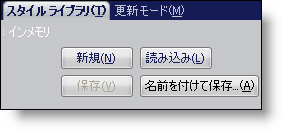
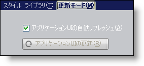
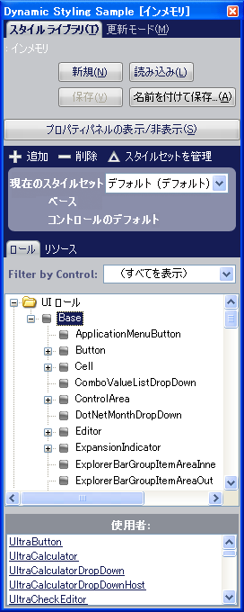

////

|metadata|
{
    "name": "styling-guide-styling-your-application-at-run-time",
    "controlName": [],
    "tags": ["How Do I","Styling","Theming"],
    "guid": "{C644264D-3E86-4211-832B-723D3A1EFAD6}",  
    "buildFlags": [],
    "createdOn": "0001-01-01T00:00:00Z"
}
|metadata|
////

= ランタイムにアプリケーションをスタイル

Application Styling Framework™（ASF）は、ランタイムにアプリケーションをスタイルする機能を提供します。AppStylistSupport アセンブリの AppStylistRuntime クラスによって公開される ShowRuntimeApplicationStylingEditor メソッドを使用して、ランタイムにアプリケーションをスタイルするために特に設計されたよりコンパクトなバージョンの AppStylist for Windows Forms を実行できます。

起動すると、ランタイム バージョンの AppStylist は link:styling-guide-style-explorer.html[スタイル エクスプローラ]と link:styling-guide-properties-panel.html[プロパティ パネル]という 2 つの個別のウィンドウを表示します。プロパティ パネルは、デザインタイム バージョンの AppStylist と全く同じ見栄えと機能を提供します。

ランタイム バージョンの AppStylist のスタイル エクスプローラは、ランタイムではスタイル エクスプローラにタブ付きのインタフェースと [ファイル] メニューの代わりとなる [プロパティ ウィンドウを表示] ボタンが含まれている点を除き、デザインタイム バージョンと非常に似ています。このタブ付きのインタフェースには、スタイル ライブラリとアップデート モードという 2 つのタブがあります。

* *スタイル ライブラリ* – このタブにはスタイル ライブラリをロードおよび保存するだけでなく、新しいスタイル ライブラリを開くためのボタンが含まれています。これらのボタンは、デザインタイム バージョンの AppStylist の [ファイル] メニューと同様に機能します。

* *アップデート モード* – 変更を行ったときには常にAppStylist がアプリケーションの UI を自動的に更新するようにしたい場合には、このチェックボックスを選択します。このチェックボックスの選択を解除した場合には、[アプリケーション UI を更新] ボタンをクリックすることによって手動で UI を更新することができます。

