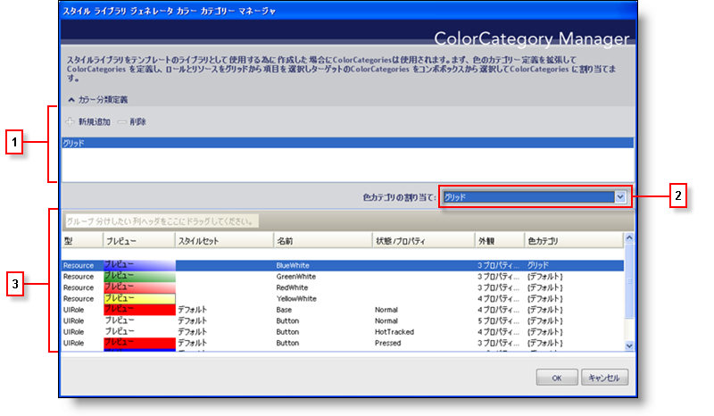

////

|metadata|
{
    "name": "styling-guide-the-style-library-generator-colorcategory-manager-dialog-box",
    "controlName": [],
    "tags": ["Styling","Theming"],
    "guid": "{14F85B39-FF4A-46E6-B255-E31C341170E5}",  
    "buildFlags": [],
    "createdOn": "0001-01-01T00:00:00Z"
}
|metadata|
////

= スタイル ライブラリ ジェネレータ カラー カテゴリー マネージャ ダイアログ ボックス

テンプレートに基づいてスタイル ライブラリを作成する前に、テンプレート自体を作成する必要があります。スタイル ライブラリのテンプレートは、リソースと UI ロールに関連付けられたカラー カテゴリーを持つ単なるスタイル ライブラリです。スタイルセットのすべての hottracked 項目の色を変更するカラー カテゴリーを作成する、または各コンポーネントの基本色を管理するカラー カテゴリーを作成することができます。

[start=1]
. *カラー カテゴリーの定義* -- このセクションではカラー カテゴリーを管理します。[新規追加] をクリックして新しいカラー カテゴリーを追加します。[削除] をクリックして現在選択されているカラー カテゴリーを削除します。テンプレートから新しいスタイル ライブラリを作成するために、これらのカラー カテゴリーが使用されます。[テンプレートから新しいスタイル ライブラリ] ダイアログ ボックスで、カラー カテゴリーに色を指定する機会を得ることができます。
[start=2]
. *カラー カテゴリーを指定* -- このドロップダウン リストには、[デフォルト]、[なし]、ならびに [カラー カテゴリーの定義] セクションのすべてのカラー カテゴリーが常に表示されます。以下のセクションの選択した [リソースまたはUI ロール] に、カラー カテゴリーを指定できます。
[start=3]
. *リソースまたはUI ロール* -- 現在のスタイル ライブラリにあるすべての修正した [リソースまたはUI ロール] がこのセクションに表示されます。項目がリソースまたは UI ロールのどちらか、項目がどのスタイルセットに属しているのか、どの状態およびプロパティに適用されるのか、修正された外観プロパティの数、そして最後に項目に指定されたカラー カテゴリーなど、多くの情報がここに表示されます。Ctrl キーを押したまま項目を選択するか、Shift キーを使用して現在選択されている項目と次にクリックする項目の間にあるすべての項目を選択することによって、ひとつまたは複数の項目を簡単に選択できます。