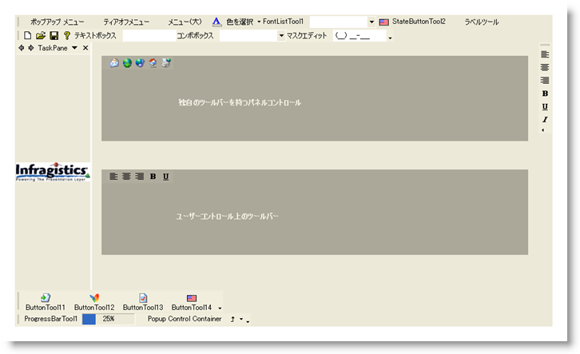

////

|metadata|
{
    "name": "styling-guide-toolbars-canvas",
    "controlName": [],
    "tags": ["Styling","Theming"],
    "guid": "{12B946FF-EEF2-4FC7-AC0C-5DA79EE53B19}",  
    "buildFlags": [],
    "createdOn": "0001-01-01T00:00:00Z"
}
|metadata|
////

= Toolbars キャンバス

Toolbar キャンバスに WinToolbarManager コンポーネントを伴うすべてのスタイリング修正を表示します。 このキャンバスには、ユーザー固有のアプリケーションで遭遇する可能性がある、複数の一般的な構成で WinToolbarManager コントロールが表示されます。 Toolbar キャンバスに以下のコントロールがあります。

* WinToolbarsManager

