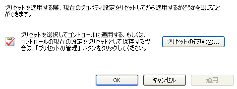
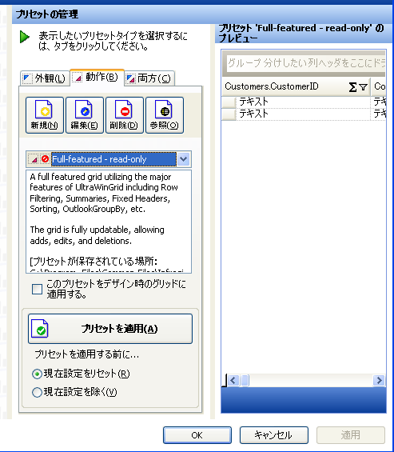

////
|metadata|
{
    "name": "styling-guide-working-with-presets",
    "controlName": [],
    "tags": ["Styling","Theming"],
    "guid": "{E3204B64-1696-4EE4-A0B0-1A9C993DE729}",
    "buildFlags": [],
    "createdOn": "2005-07-06T00:00:00Z"
}
|metadata|
////

= プリセットでの操作

WinGrid コントロールを利用するコントロールだけでなく、WinGrid コントロールにプリセットを適用できます。プリセットは、インタフェースのエレメント、およびアプリケーション全体で広範なフォーマッティングおよび動作オプションを素早くシンプルに適用する方法です。これは多くの異なる開発者間で整合性のあるルック アンド フィールを維持する必要がある企業の開発環境で理想的です。

{ProductName} は、Look、Behavior、Combined プリセットの 3 種類のプリセットを提供しています。名前が示すように、Look プリセットにはコントロールの視覚的スタイル情報のみが含まれ、Behavior プリセットにはコントロールの動作方法に関する情報が含まれ、そして Combined プリセットには Look と Behavior 両方の情報が含まれます。

Infragistics が提供するすべての {ProductName} コントロール/コンポーネントのインボックス プリセットのファイルの場所については、 link:getting-started-where-files-are-placed-on-your-file-system-during-installation.html[インストール時のシステム上のファイルの配置場所] を参照してください。

== クイック スタートを使用してプリセットを管理および適用

コントロールのデザイナを開いて、{ProductName} コントロールにプリセットを適用します。通常この作業は、コントロールのコンテキスト メニューから [デザイナ] メニューを選択する、または [Visual Studio アクション リスト] からデザイナ アクションを選択して実行します。デザイナを開くについては、 link:win-getting-started.html[「Windows Forms コントロール/コンポーネントの概要」]を参照してください。

いったんデザイナを開いたら、ナビゲーション ツリーの Presets ノードを選択します。Presets ノードは、ひとつの基本オプション [プリセットの管理] を提供します。

=== プリセットの選択

既存のプリセットをコントロールに適用したい場合には、[プリセットの管理] ボタンをクリックします。これによって、以下に示すデザイナの [プリセットの管理] 領域が開きます。

[プリセットの管理] 領域によって、コントロールで使用可能なすべてのプリセットを表示して、適用したいプリセットを選択できます。デフォルトで、リスト ボックスに {ProductName} とともに出荷されるインボックス プリセットを表示します。以下に示す [プリセット] フォルダを変更することで、リスト ボックスがプリセットを検索する場所を変更できます。

コントロールで使用可能なプリセットはリスト ボックスに表示されます。適切なタブを選択して、Look、Behavior、Combined プリセットを表示できます。リストボックスで異なるプリセットをクリックすると、右側のプリセット プレビュー ペインには、選択したプリセットを適用してコントロールのプレビューが表示されます。

コントロールに適用したいプリセットが見つかれば、プリセットをコントロールに適用するために [プリセットを適用] ボタンをクリックする必要があります。

=== プリセットを保存

もうひとつのプリセット オプションは、固有のカスタム プリセットを作成します。カスタム プリセットは 2 つの方法で作成できます。最初の方法は、コントロールの外観と動作を完全にカスタマイズして、[プリセットの管理] 領域の [新規] ボタンをクリックして、プリセットとして保存できます。2 番目の方法は、既存のプリセットを編集して、[プリセットの管理] 領域の [編集] ボタンをクリックすることで固有のカスタム バージョンとして修正したプリセットを保存できます。

プリセットの保存の方法は、コントロールを作成する方法にかかわらず同一です。[新規] または [編集] ボタンをクリックすると、プリセットを作成または編集できるダイアログが開きます。

このダイアログ ボックスによって、保存したいプリセットのタイプ（Look、Behavior、Combined）を指定するだけでなく、名前と説明をプリセットに指定できます。これらの属性を入力したら、プロパティ グリッドを使用してカスタム プリセットを作成できます。コントロールのプロパティを変更すると、ダイアログ ボックスの右下隅にあるコントロール プレビューを使用してプレビューできます。プリセットの編集が完了したら、プリセットを保存するには [追加] ボタンをクリックするだけです。