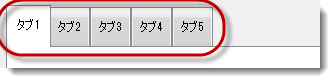
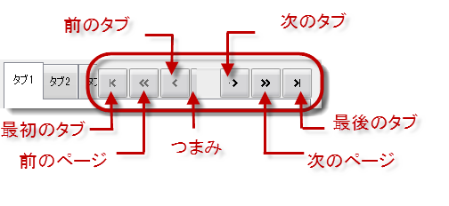
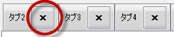
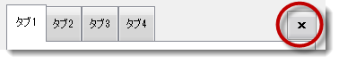
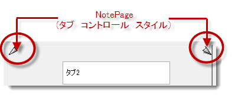
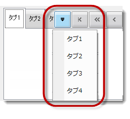

////

|metadata|
{
    "name": "touch-enabled-tab-controls",
    "controlName": [],
    "tags": [],
    "guid": "c7d50c63-c7bb-4d2b-aa2d-208fad8fab23",  
    "buildFlags": [],
    "createdOn": "2013-01-10T21:52:21.6356904Z"
}
|metadata|
////

= タッチ対応のタブ コントロール

== トピックの概要

=== 目的

このトピックでは、 _WinTab_   および  _WinTabStrip_  、 _WinTabbedMdiManager_   を含む、 _Infragistics_   タッチ有効な Tab コントロールおよびコンポーネントについて説明します。

=== このトピックの内容

このトピックは、以下のセクションで構成されます。

* <<_Ref344307846,タッチ可能な  _WinTab_   および  _WinTabStrip_   コントロール要素>>

** <<_Ref342757493,概要>>
** <<_Ref344307859,タブ要素>>
** <<_Ref344307867,スクロール ボタン>>
** <<_Ref344308300,閉じるボタン>>
** <<_Ref344307892,NotePage 要素>>
** <<_Ref344731499,タブ リスト ボタン>>

* <<_Ref344731514,タッチ可能な  _WinTabbedMdiManager_   コンポーネント要素>>

** <<_Ref344731523,概要>>
** <<_Ref344731534,タブ要素>>
** <<_Ref344731544,スクロール ボタン>>
** <<_Ref344731554,閉じるボタン>>
** <<_Ref344320711,スプリッター要素>>
** <<_Ref344320719,タブ リスト ボタン>>

* <<_Ref342757647,関連コンテンツ>>

[[_Ref342757484]]
[[_Ref344307846]]
== タッチ可能な  _WinTab_   および  _WinTabStrip_   コントロール要素

[[_Ref342757493]]

=== 概要

以下のセクションは、タッチ可能な  _WinTab および WinTabStrip_   コントロールについて説明します。WinTab および WinTabStrip のタッチ可能な要素は同じです。そのため、画像は両方のコントロールで有効です。

[[_Ref344307859]]

=== タブ要素

[[_Ref344307867]]

=== スクロール ボタン

コントロールの `ScrollButtonTypes` プロパティを使用して、スクロール ボタンを表示します。デフォルトでは、タブ追加すると、表示領域に収まるように [前のタブ] ボタンおよび [次へタブ] ボタンが表示されます。

*C# の場合:*

[source,csharp]
----
ultraTabControl1.ScrollButtonTypes = Infragistics.Win.UltraWinTabs.ScrollButtonTypes.FirstLast;
----

*Visual Basic の場合:*

[source,vb]
----
ultraTabControl1.ScrollButtonTypes = Infragistics.Win.UltraWinTabs.ScrollButtonTypes.FirstLast
----

[[_Ref344307876]]

=== 閉じるボタン

[閉じる] ボタン (タブ) は、そのボタンのあるタブのみ閉じます。

[閉じる] ボタン (タブ ヘッダー領域) は、アクティブなタブを閉じます。

[[_Ref344307892]]

=== NotePage 要素

_NotePage_   および  _NotePageFlat_   は、タッチ可能な要素であるタブ コントロール スタイルで、ページを戻るまたは次のページへ移動する機能を提供します。

[[_Ref344307899]]

=== タブ リスト ボタン

リストの項目は、項目のリストをドロップ ダウンするボタン同様にタッチ可能です。

[[_Ref344731514]]
== タッチ可能な  _WinTabbedMdiManager_   コンポーネント要素

[[_Ref344731523]]

=== 概要

以下のセクションは、 _WinTabbedMdiManager_   コンポーネントのタッチ可能な要素を示します。

[[_Ref344731534]]

=== タブ要素

image::images/Touch_Tab_Controls_and_Components_7.png[]

[[_Ref344731544]]

=== スクロール ボタン

コントロールの `ScrollButtonTypes` プロパティを使用して、スクロール ボタンを表示します。デフォルトでは、タブ追加した際に表示領域に収まるように [前のタブ] ボタンおよび [次へタブ] ボタンが表示されます。

*C# の場合:*

[source,csharp]
----
ultraTabbedMdiManager1.TabGroupSettings.ScrollButtonTypes =
Infragistics.Win.UltraWinTabs.ScrollButtonTypes.FirstLast;
----

*Visual Basic の場合:*

[source,vb]
----
ultraTabbedMdiManager1.TabGroupSettings.ScrollButtonTypes = Infragistics.Win.UltraWinTabs.ScrollButtonTypes.FirstLast
----

image::images/Touch_Tab_Controls_and_Components_8.png[]

[[_Ref344731554]]

=== 閉じるボタン

[閉じる] ボタン (タブ) は、そのボタンのあるタブのみ閉じます。

image::images/Touch_Tab_Controls_and_Components_9.png[]

[閉じる] ボタン (タブ ヘッダー領域) は、アクティブ タブを閉じます。

image::images/Touch_Tab_Controls_and_Components_10.png[]

[[_Ref344320711]]

=== スプリッター要素

image::images/Touch_Tab_Controls_and_Components_11.png[]

[[_Ref344320719]]

=== タブ リスト ボタン

リストの項目およびドロップダウン ボタンは、タッチ可能な要素です。

image::images/Touch_Tab_Controls_and_Components_12.png[]

[[_Ref342757647]]
== 関連コンテンツ

=== トピック

このトピックにの追加情報については、以下のトピックも合わせてご参照ください。

[options="header", cols="a,a"]
|====
|トピック|目的

| link:wintouchprovider-overview.html[タッチ サポートの概要]
|このトピックでは、 _Infragistics_ のタッチ有効なコントロールおよびコンポーネントについての概念を提供します。

| link:touch-enabled-editor-controls.html[タッチ エディター コントロールおよび要素]
|このトピックでは、 _Infragistics_ のタッチ有効なエディターコントロールおよび要素について説明します。

| link:touch-enabled-wingrid-control-elements.html[タッチ WinGrid コントロール要素]
|このトピックでは、 _Infragistics_ のタッチ有効な _WinGrid_ コントロール要素について説明します。

| link:touch-enabled-winlistview-control.html[タッチ WinListView コントロール]
|このトピックでは、 _Infragistics_ のタッチ有効な _WinListView_ コントロール要素について説明します。

| link:touch-enabled-wintree-control.html[タッチ WinTree コントロール]
|このトピックでは、 _Infragistics_ のタッチ有効な _WinTree_ コントロール要素について説明します。

|====