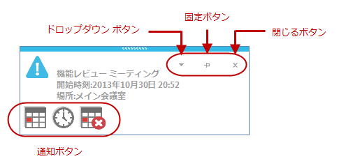

////

|metadata|
{
    "name": "touch-enabled-windesktopalert",
    "controlName": [],
    "tags": [],
    "guid": "9f8f1821-0588-4839-835f-4b2d5c3e8bc1",  
    "buildFlags": [],
    "createdOn": "2013-09-15T23:54:34.2453419Z"
}
|metadata|
////

= タッチ対応の WinDesktopAlert

== トピックの概要

=== 目的

このトピックは、 _Infragistics_   のタッチ対応  _WinDesktopAlert_™ コントロール要素を紹介します。

== _WinDesktopAlert_   のタッチ対応要素

=== タッチ対応要素

以下のスクリーンショットに、 _WinDesktopAlert_   コントロールのタッチ対応要素の概略を示します。タッチ要素は、タッチ対応モードで若干大きく表示されます。

.注:
[NOTE]
====
link:{ApiPlatform}win{ApiVersion}~infragistics.win.touch.ultratouchprovider_members.html[UltraTouchProvider] のタッチ対応設定の状態はキャッシュされ、警告ウィンドウの表示中に使用されます。 link:{ApiPlatform}win{ApiVersion}~infragistics.win.touch.ultratouchprovider_members.html[UltraTouchProvider] の `Enabled` プロパティを切り替えても、すでに表示された警告ウィンドウに大きな影響はありません。
====

== 関連コンテンツ

=== トピック

このトピックの追加情報については、以下のトピックも合わせてご参照ください。

[options="header", cols="a,a"]
|====
|トピック|目的

| link:wintouchprovider.html[タッチ サポート]
|このセクションには、Infragistics __ のコントロールとコンポーネントを使用して、タッチ対応アプリケーションを開発するための機能について説明する特定のトピックへのリンクが含まれています。

| link:touch-gestures.html[タッチ ジェスチャ]
|このグループのトピックは、 _Infragistics_ タッチ対応コントロールのタッチ ジェスチャを紹介します。

| link:windesktopalert.html[WinDesktopAlert]
|このセクションには、コンポーネントについての概要からアプリケーションで使用する理由、コンポーネントを使用して共通タスクを実行する手順などの _WinDesktopAlert_™ についての有益な情報が含まれています。

|====