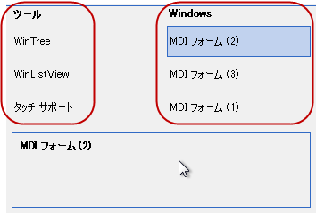

////

|metadata|
{
    "name": "touch-enabled-windockmanager",
    "controlName": [],
    "tags": [],
    "guid": "db2fa778-69eb-428f-903a-07f3c0d64269",  
    "buildFlags": [],
    "createdOn": "2013-09-15T23:55:25.4004569Z"
}
|metadata|
////

= タッチ対応の WinDockManager

== トピックの概要

=== 目的

このトピックは、 _Infragistics_   のタッチ対応  _WinDockManager_™ コントロール要素を紹介します。

== _WinDockManager_   のタッチ対応要素とジェスチャ

=== タッチ対応要素

以下のスクリーンショットは、 _WinDockManager_   コントロールのタッチ対応要素を示します。タッチ要素は、タッチ対応モードで若干大きく表示されます。

[options="header", cols="a,a"]
|====
|要素名|画像

|PaneCaptionButtons
|image::images/Touch_WinDockManager_1.png[]

|Tab
|image::images/Touch_WinDockManager_2.png[]

|タブ（縮小されたビュー）
|image::images/Touch_WinDockManager_3.png[]

|ペイン キャプション メニュー
|image::images/Touch_WinDockManager_4.png[]

|ナビゲーター項目
|MDI の親フォームで _UltraDockManager_ を使用すると、ナビゲーター ダイアログが表示されます。`Ctrl+Tab` キーを長押しすると、ナビゲーター ダイアログが表示されます。 

|WindowDockingAreaSplitter
|image::images/Touch_WinDockManager_6.png[]

|====

== 関連コンテンツ

=== トピック

このトピックの追加情報については、以下のトピックも合わせてご参照ください。

[options="header", cols="a,a"]
|====
|トピック|目的

| link:wintouchprovider.html[タッチ サポート]
|このセクションには、Infragistics __ のコントロールとコンポーネントを使用して、タッチ対応アプリケーションを開発するための機能について説明する特定のトピックへのリンクが含まれています。

| link:touch-gestures.html[タッチ ジェスチャ]
|このグループのトピックは、 _Infragistics_ タッチ対応コントロールのタッチ ジェスチャを紹介します。

| link:windockmanager.html[WinDockManager]
|このセクションには、コンポーネントについての概要からアプリケーションで使用する理由、コンポーネントを使用して共通タスクを実行する手順などの _WinDockManager_ についての有益な情報が含まれています。

|====