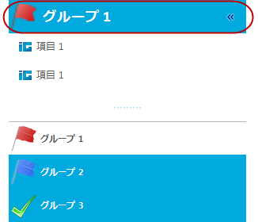
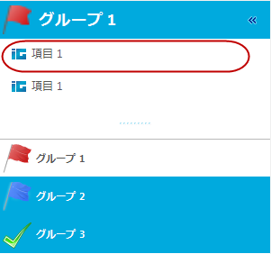
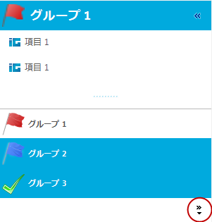
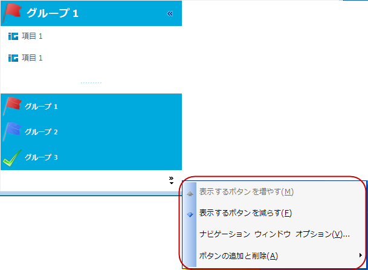
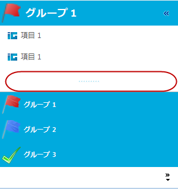
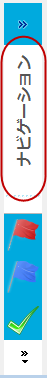

////

|metadata|
{
    "name": "touch-enabled-winexplorerbar",
    "controlName": [],
    "tags": [],
    "guid": "abd70838-3ed0-4e28-b8b4-1de39fcb60db",  
    "buildFlags": [],
    "createdOn": "2013-09-15T23:56:18.1817345Z"
}
|metadata|
////

= タッチ対応の WinExplorerBar

== トピックの概要

=== 目的

このトピックは、 _Infragistics_   のタッチ対応  _WinExplorerBar_™ コントロール要素を紹介します。

== タッチ対応の  _WinExplorerBar_   要素

=== タッチ対応要素

以下のスクリーンショットは、 _WinExplorerBar_   コントロールのタッチ対応要素を示します。タッチ要素は、タッチ対応モードで若干大きく表示されます。このコントロールは、以下のリストのスタイル オプションを提供します。一部の要素はすべてのスタイルで視覚的に表示されますが、その他の要素は一部のスタイルのみで表示されます。

使用できるスタイルは以下のとおりです:

* `ExplorerBar`

* `ListBar`

* `OutlookNavigationPane`

* `Toolbox`

* `VisualStudio2005Toolbox`

[options="header", cols="a,a"]
|====
|要素名|画像

|UltraExplorerBarGroupHeader
|この要素はすべてのスタイルで視覚的に表示されます。 

|Item
|この要素はすべてのスタイルで視覚的に表示されます。 

|Navigation Overflow QuickCustomizeButton
|この要素は `OulookNavigationPane` スタイルのみで視覚的に表示されます。 

|NavigationOverflowQuickCustomize メニュー
|この要素は `OulookNavigationPane` スタイルのみで視覚的に表示されます。 

|NavigationSplitterBar
|この要素は `OulookNavigationPane` スタイルのみで視覚的に表示されます。 

|NavigationPaneExpansionButton
|この要素は `OulookNavigationPane` の縮小ビューのみで視覚的に表示されます。

|
|image::images/Touch_WinExplorerBar_6.png[]

|NavigationPaneCollapsedGroupArea
|この要素は `OulookNavigationPane` の縮小ビューのみで視覚的に表示されます。 

|====

== 関連コンテンツ

=== トピック

このトピックの追加情報については、以下のトピックも合わせてご参照ください。

[options="header", cols="a,a"]
|====
|トピック|目的

| link:wintouchprovider.html[タッチ サポート]
|このセクションには、Infragistics のコントロールとコンポーネントを使用して、タッチ対応アプリケーションを開発するための機能について説明する特定のトピックへのリンクが含まれています。

| link:touch-gestures.html[タッチ ジェスチャ]
|このグループのトピックは、 _Infragistics_ タッチ対応コントロールのタッチ ジェスチャを紹介します。

|====