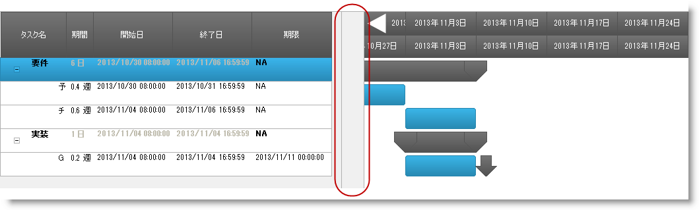
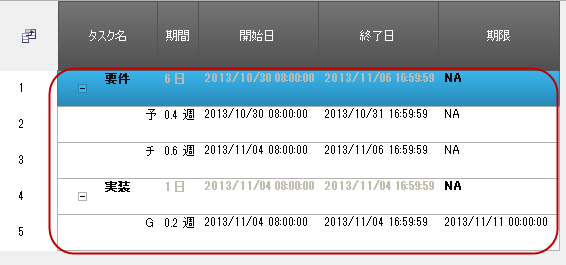
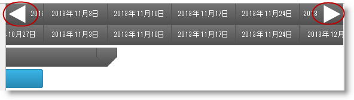
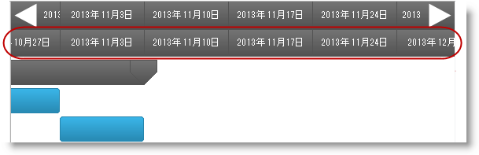
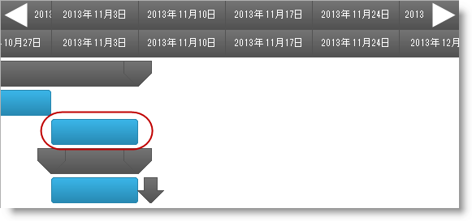
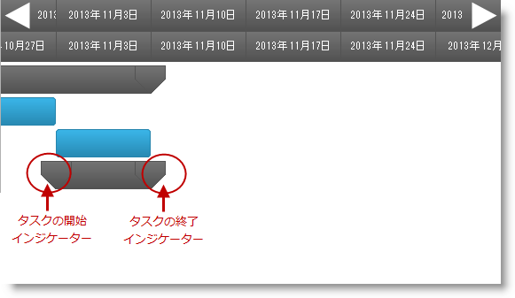
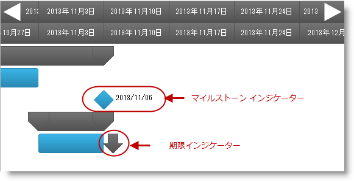
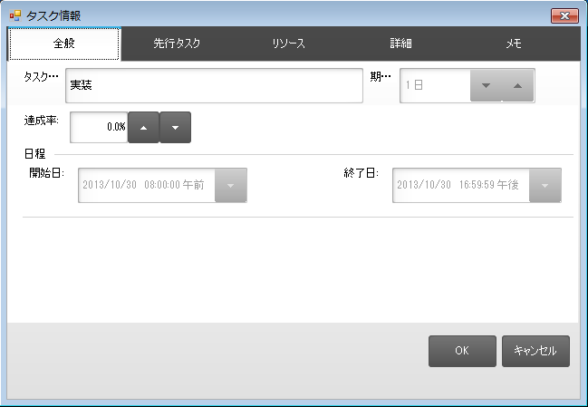

////

|metadata|
{
    "name": "touch-enabled-winganttview",
    "controlName": [],
    "tags": [],
    "guid": "af764b66-46d4-4283-b9d0-8b3ea30f040e",  
    "buildFlags": [],
    "createdOn": "2013-09-15T23:56:57.2656425Z"
}
|metadata|
////

= タッチ対応の WinGanttView

== トピックの概要

=== 目的

このトピックでは、 _Infragistics_   のタッチ対応  _WinGanttView_™ コントロール要素を紹介します。

== _WinGanttView_   タッチ対応要素とジェスチャ

=== タッチ対応要素

_WinGanttView_   コントロールのタッチ対応要素を、以下のスクリーンショットにアウトラインで示します。タッチ要素は、タッチ対応モードで若干大きく表示されます。

==== VerticalSplitter 要素

スプリッターは、グリッドとタイムラインの両方のセクションが表示されている場合にドラッグできます。

==== Row 要素

==== DateNavigationButton 要素

==== ColumnHeader 要素

==== TaskBar 要素

タスク バーの操作は、パンではなく、バーをドラッグして実行します。

==== タスクの開始インジケーターと終了インジケーター

タスクの開始インジケーター要素は、タスクの開始日を示します。

タスクの終了インジケーター要素は、タスクの終了日を示します。

==== タスクのマイルストーン インジケーターと期限インジケーター

タスクのマイルストーン要素はタスクの成果物を示します。

タスクの期限要素は、タスクの完了日を示します。

.注:
[NOTE]
====
タスク情報ダイアログでもタッチがサポートされています。要素は、ユーザー操作を簡単にするためにサイズが大きくなります。
====

=== ジェスチャ サポート

_WinGanttView_   コントロールのジェスチャ サポートは、垂直および水平パンとフリック (詳細は link:touch-gestures.html[タッチ ジェスチャ]を参照) で構成されています。

== 関連コンテンツ

=== トピック

このトピックの追加情報については、以下のトピックも合わせてご参照ください。

[options="header", cols="a,a"]
|====
|トピック|目的

| link:wintouchprovider.html[タッチ サポート]
|このセクションには、Infragistics のコントロールとコンポーネントを使用して、タッチ対応アプリケーションを開発するための機能について説明する特定のトピックへのリンクが含まれています。

| link:touch-gestures.html[タッチ ジェスチャ]
|このグループのトピックは、 _Infragistics_ タッチ対応コントロールのタッチ ジェスチャを紹介します。

|====