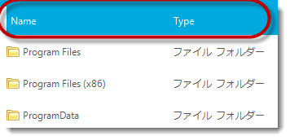
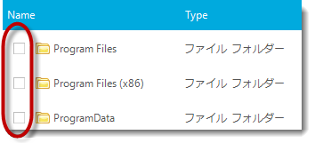

////

|metadata|
{
    "name": "touch-enabled-winlistview-control",
    "controlName": [],
    "tags": [],
    "guid": "3ac3a47b-87f6-4877-9004-2e4a5051b2cd",  
    "buildFlags": [],
    "createdOn": "2013-01-10T21:53:38.0633324Z"
}
|metadata|
////

= タッチ対応の WinListView コントロール

== トピックの概要

=== 目的

このトピックは、Infragistics のタッチ有効な  _WinListView_   _™_   コントロール要素について説明します。

=== このトピックの内容

このトピックは、以下のセクションで構成されます。

* <<_Ref344307846, _WinListView_   コントロール要素を>>

** <<_Ref342757493,概要>>
** <<_Ref344991601,詳細ビュー>>
** <<_Ref344991609,チェックボックス付き詳細ビュー>>
** <<_Ref345060108,アイコン ビュー>>
** <<_Ref344994817,リスト ビュー>>
** <<_Ref344994827,チェックボックス付きリスト ビュー>>
** <<_Ref344991617,サムネイル ビュー>>
** <<_Ref345060116,タイル ビュー>>

* <<_Ref344993258,関連コンテンツ>>

[[_Ref342757484]]
[[_Ref344307846]]
== _WinListView_   コントロール要素をタッチ有効にする

[[_Ref342757493]]

=== 概要

以下のセクションでは、 _WinListView_   _™_   コントロールの複数のビューで red にカプセル化される、タッチ可能な要素を示します。

[[_Ref344991601]]

=== 詳細ビュー

_Details_   ビューは、列ヘッダーを表示する唯一のビューです。

[[_Ref344991609]]

=== チェックボックス付き詳細ビュー

_Details_   または  _List_   ビューでのみチェックボックスを有効にできます。

*C# の場合:*

[source,csharp]
----
ultraListView1.View = UltraListViewStyle.Details;
ultraListView1.ViewSettingsDetails.CheckBoxStyle = CheckBoxStyle.CheckBox;
----

*Visual Basic の場合:*

[source,vb]
----
ultraListView1.View = UltraListViewStyle.Details
ultraListView1.ViewSettingsDetails.CheckBoxStyle = CheckBoxStyle.CheckBox
----

[[_Ref344994809]]

=== アイコン ビュー

image::images/Touch_WinListView_Control_3.png[]

[[_Ref344994817]]

=== リスト ビュー

image::images/Touch_WinListView_Control_4.png[]

[[_Ref344994827]]

=== チェックボックス付きリスト ビュー

チェックボックスは、 _Details_   または  _List_   ビューでのみ有効にできます。

*C# の場合:*

[source,csharp]
----
ultraListView1.View = UltraListViewStyle.List;
ultraListView1.ViewSettingsList.CheckBoxStyle = CheckBoxStyle.CheckBox;
----

*Visual Basic の場合:*

[source,vb]
----
ultraListView1.View = UltraListViewStyle.List
ultraListView1.ViewSettingsList.CheckBoxStyle = CheckBoxStyle.CheckBox
----

image::images/Touch_WinListView_Control_5.png[]

[[_Ref344991617]]

=== サムネイル ビュー

image::images/Touch_WinListView_Control_6.png[]

[[_Ref345060116]]

=== タイル ビュー

image::images/Touch_WinListView_Control_7.png[]

[[_Ref344993258]]
== 関連コンテンツ

=== トピック

このトピックについては、以下のトピックも合わせてご参照ください。

[options="header", cols="a,a"]
|====
|トピック|目的

| link:wintouchprovider-overview.html[タッチ サポートの概要]
|このトピックでは、Infragistics のタッチ有効なコントロールおよびコンポーネントについての概念を提供します。

| link:touch-enabled-editor-controls.html[タッチ エディター コントロールおよび要素]
|このトピックでは、Infragistics のタッチ有効なエディターコントロールおよび要素について説明します。

| link:touch-enabled-wingrid-control-elements.html[タッチ WinGrid コントロール要素]
|このトピックでは、Infragistics のタッチ有効な _WinGrid_ コントロール要素について説明します。

| link:touch-enabled-tab-controls.html[タッチ タブ コントロールおよびコンポーネント]
|このトピックでは、 _WinTab_ および _WinTabStrip_ 、 _WinTabbedMdiManager_ を含む、Infragistics タッチ有効な Tab コントロールおよびコンポーネントについて説明します。

| link:touch-enabled-wintree-control.html[タッチ WinTree コントロール]
|このトピックでは、Infragistics のタッチ有効な _WinTree_ コントロール要素について説明します。

|====