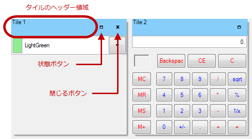

////

|metadata|
{
    "name": "touch-enabled-wintilepanel",
    "controlName": [],
    "tags": [],
    "guid": "75f6b453-3dbc-449f-8827-326a0bf15596",  
    "buildFlags": [],
    "createdOn": "2014-01-29T17:14:23.9253767Z"
}
|metadata|
////

= タッチ対応の WinTilePanel

== トピックの概要

=== 目的

このトピックは、Infragistics のタッチ対応  _WinTilePanel_™ コントロール要素を紹介します。

== タッチ対応の  _WinTilePanel_   要素

=== タッチ対応要素

タッチ対応の要素は Touch モードで大きく表示されます。コントロールの link:{ApiPlatform}win.misc{ApiVersion}~infragistics.win.misc.ultrapanel~getpreferredsize.html[GetPreferredSize] メソッドは、最小サイズとしてタッチ メトリックスを使用します。コントロールを自動サイズに設定、またはタッチ対応のサイズとしてアプリケーション開発者が明示的にサイズを設定できます。

以下のタッチ対応の要素は以下の操作のために使用されます。

*  *タイルのヘッダー領域*  – ドラッグ アンド ドロップ
*  *状態ボタン*  – 最小化および最大化
*  *閉じるボタン*  – 閉じる、またはビューからの削除

.注:
[NOTE]
====
標準のビューで、ジェスチャはマウス操作に変換されます。タッチ操作でタイルをドラッグするか、タップしてボタンと操作できます。
====

== 関連コンテンツ

=== トピック

このトピックの追加情報については、以下のトピックも合わせてご参照ください。

[options="header", cols="a,a"]
|====
|トピック|目的

| link:wintouchprovider.html[タッチ サポート]
|このセクションには、Infragistics のコントロールとコンポーネントを使用して、タッチ対応アプリケーションを開発するための機能について説明する特定のトピックへのリンクが含まれています。

| link:touch-gestures.html[タッチ ジェスチャ]
|このグループのトピックは、Infragistics タッチ対応コントロールのタッチ ジェスチャを紹介します。

|====